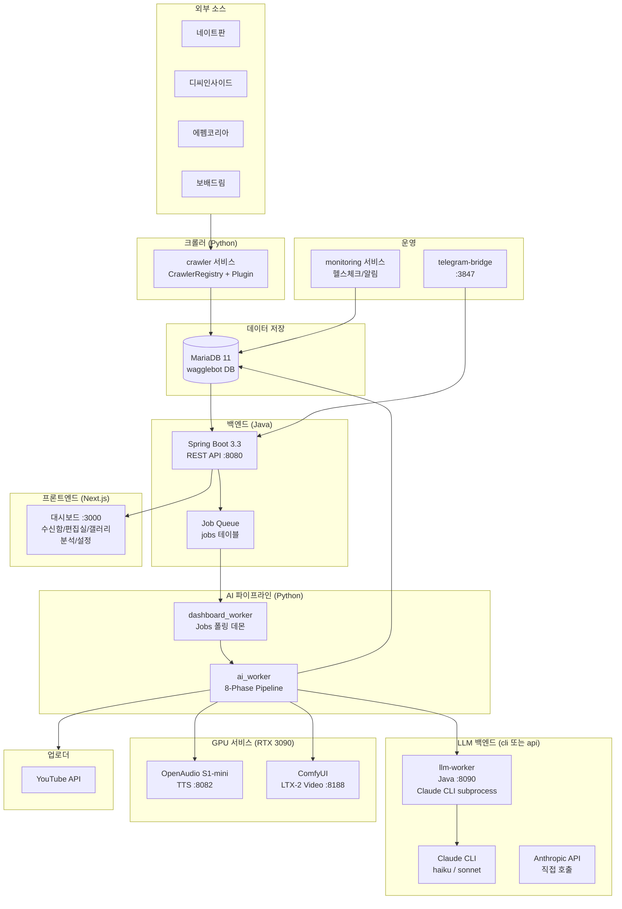

# WaggleBot — 시스템 컨텍스트 (L1)

> last-verified: 2026-06-12 (commit `656dffd`) · code-ref: 전역
> scope: 시스템 외부 경계, 행위자, 전체 흐름 — SSOT

커뮤니티 게시글을 자동 크롤링해 LLM 대본 → TTS → LTX-2 비디오 → FFmpeg 렌더링 → YouTube 자동 업로드까지 처리하는 AI 콘텐츠 자동화 파이프라인.

## 전체 시스템 흐름

## 행위자 및 외부 시스템

| 행위자 / 시스템 | 역할 |
|---------------|------|
| 운영자 (관리자) | 대시보드에서 게시글 승인/거절, 설정 변경 |
| 커뮤니티 사이트 | 원시 게시글·댓글 공급 (네이트판·디씨·에펨코리아·보배드림 등) |
| Claude API (Anthropic) | LLM 추론 — 대본 생성·씬 지시·번역·피드백 분석 |
| YouTube Data API | 최종 영상 업로드, 조회수/성과 데이터 수집 |
| Telegram Bot API | 운영자 원격 제어 인터페이스 (선택) |

> 상세 배포 구성(포트·볼륨·환경변수) → [`docs/20-containers/topology.md`](../20-containers/topology.md)
> 8-Phase AI 파이프라인 책임 → [`docs/30-components/pipeline.md`](../30-components/pipeline.md)
> Post 상태 전이 → [`docs/60-runtime/post-state-machine.md`](../60-runtime/post-state-machine.md)
