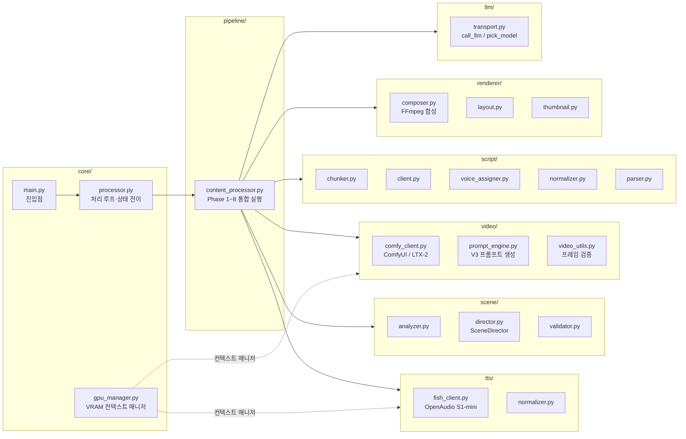
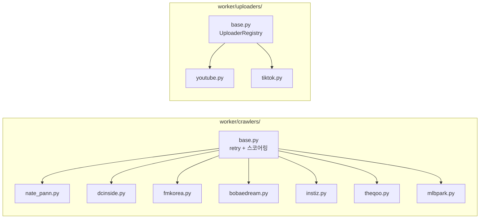

# WaggleBot — 컴포넌트 개요 (L3)

> last-verified: 2026-06-14 · code-ref: `worker/ai_worker/`, `worker/crawlers/`, `worker/uploaders/`, `backend/`, `frontend/`
> scope: 컨테이너 내부 모듈 책임 — SSOT

## ai_worker 내부 모듈 구조

## 모듈 책임 표

| 모듈 | 경로 | 책임 | 불변식 |
|------|------|------|--------|
| `core/main.py` | `worker/ai_worker/core/main.py` | 서비스 진입점, 시그널 핸들링 | — |
| `core/processor.py` | `worker/ai_worker/core/processor.py` | APPROVED Post 폴링 → 8-Phase 실행 → 상태 전이 | 10초 간격 폴링, 120s graceful shutdown |
| `core/gpu_manager.py` | `worker/ai_worker/core/gpu_manager.py` | GPU VRAM 컨텍스트 매니저 | 단계 후 `torch.cuda.empty_cache()` + `gc.collect()` 필수 |
| `pipeline/content_processor.py` | `worker/ai_worker/pipeline/content_processor.py` | Phase 1~8 순차 실행, Phase5‖6 asyncio.gather | GPU Phase를 Phase5‖6 병렬에 포함 금지 |
| `scene/director.py` | `worker/ai_worker/scene/director.py` | SceneDirector LLM 호출, 씬 타입/mood 할당 | 모델: sonnet |
| `script/chunker.py` | `worker/ai_worker/script/chunker.py` | LLM 청킹(Phase 2), validate_and_fix(Phase 3) | 모델: sonnet |
| `tts/fish_client.py` | `worker/ai_worker/tts/fish_client.py` | Fish Speech TTS, reference_id 클로닝, 감정 마커 | `ai_worker/video`에서 import 금지 |
| `video/comfy_client.py` | `worker/ai_worker/video/comfy_client.py` | ComfyUI API, LTX-2 워크플로우 제출, 4단계 폴백 | `ai_worker/tts` import 금지 |
| `video/prompt_engine.py` | `worker/ai_worker/video/prompt_engine.py` | video_prompt V3 생성, 비주얼 앵커, I2V brief | 모델: haiku |
| `video/video_utils.py` | `worker/ai_worker/video/video_utils.py` | `validate_frame_count()`, `validate_resolution()` | 프레임 = 1+8k (9~145) |
| `renderer/composer.py` | `worker/ai_worker/renderer/composer.py` | FFmpeg filter_complex 단일 NVENC 패스 | `h264_nvenc` 필수, 중간 재인코딩 금지 |
| `llm/transport.py` | `worker/ai_worker/llm/transport.py` | `call_llm()` / `pick_model()` | 모든 LLM 호출은 이 함수 경유 |

---

## 크롤러 / 업로더 플러그인

- 사이트 목록 하드코딩 금지 → `CrawlerRegistry.list_crawlers()` 동적 조회
- 신규 플러그인 → `worker/crawlers/ADDING_CRAWLER.md` / `worker/uploaders/ADDING_UPLOADER.md`

---

## 대시보드 / backend

| 서비스 | 위치 | 역할 |
|--------|------|------|
| `backend` | `backend/src/main/java/com/wagglebot/` | Spring Boot REST API :8080, Job 큐 enqueue, Flyway 마이그레이션 |
| `frontend` | `frontend/` | Next.js 14 어드민 대시보드 :3000, 7개 페이지 |
| `dashboard_worker` | `worker/dashboard_worker/` | `jobs` 테이블 폴링 → Job 실행 (Python) |
| `llm-worker` | `worker/llm/` | Spring Boot Claude CLI 브릿지 :8090 |

> 8-Phase 상세 → [`pipeline.md`](pipeline.md)
> 처리 루프 → [`../60-runtime/pipeline-runtime.md`](../60-runtime/pipeline-runtime.md)
