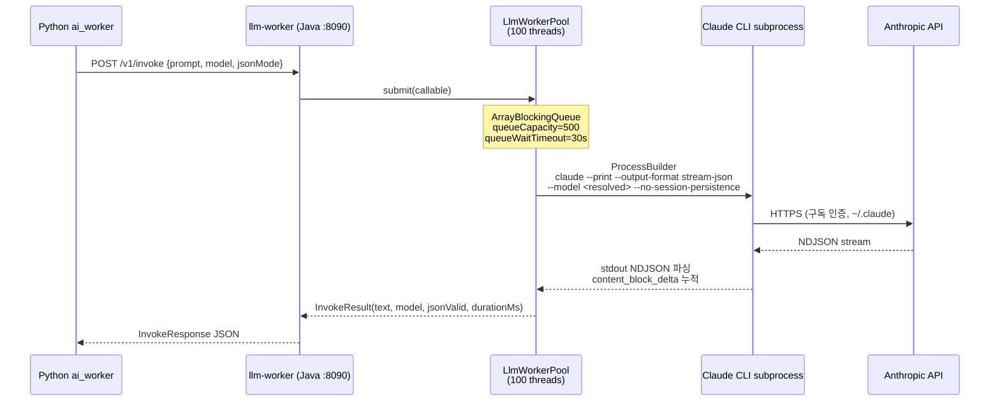

# WaggleBot — API 요청 흐름

> last-verified: 2026-06-12 (commit `656dffd`) · code-ref: `worker/llm/src/main/java/com/wagglebot/llmworker/`
> scope: llm-worker 내부 처리 흐름, JSON Mode 처리 — SSOT

## llm-worker 내부 동작 흐름



## JSON Mode 처리 흐름

```mermaid
flowchart LR
    J1[systemPrompt에<br/>JSON 지시문 추가] --> J2[LLM 응답 수신]
    J2 --> J3{코드펜스<br/>있음?}
    J3 -->|Yes| J4[정규식으로 추출<br/>```json ... ```]
    J3 -->|No| J5[중괄호 추출<br/>{ ... }]
    J4 & J5 --> J6{JSON.parse<br/>성공?}
    J6 -->|Yes| J7[jsonValid=true]
    J6 -->|No| J8[jsonValid=false<br/>text 그대로 반환]
```

> **주의 (LLM Proxy JSON quirk):** 프록시가 `jsonMode` 무시·코드펜스 첨부 가능 → Python 측에서 항상 `extract_json_object()`로 파싱할 것. `jsonValid=false` 응답도 텍스트 파싱 시도 필수.

> 엔드포인트 명세 → [`rest-spec.md`](rest-spec.md)
> Phase 5‖6 병렬 시퀀싱 → [`../60-runtime/pipeline-runtime.md`](../60-runtime/pipeline-runtime.md)
