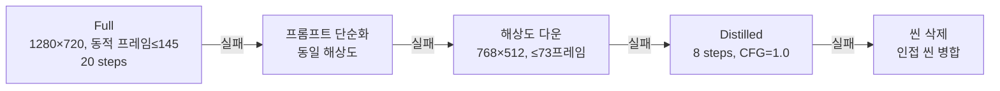
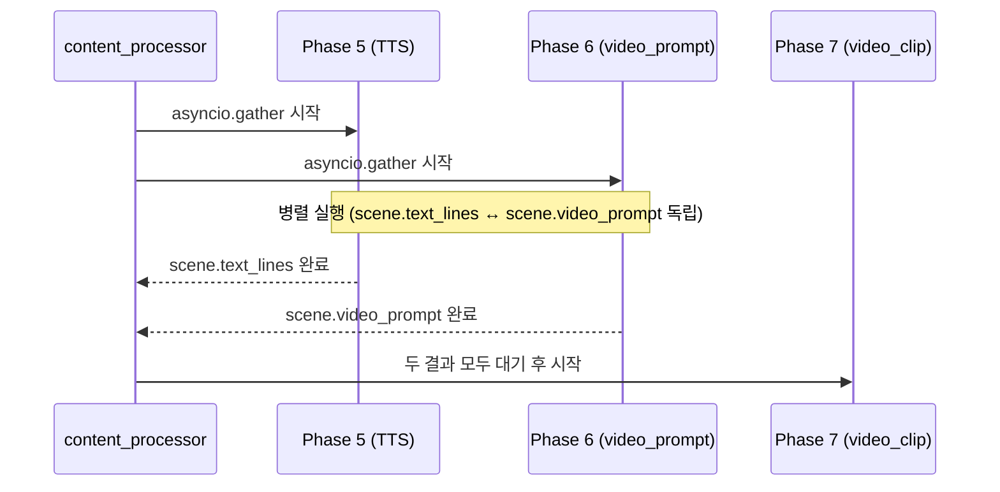
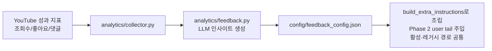

# WaggleBot — 파이프라인 런타임 동작

> last-verified: 2026-06-13 · code-ref: `worker/ai_worker/core/processor.py`
> scope: ai_worker 처리 루프, 4단계 폴백, 피드백 루프, Phase5‖6 병렬 시퀀싱 — SSOT

## 처리 루프

`ai_worker/core/processor.py`:

1. `Post.status == APPROVED` 폴링 (`AI_POLL_INTERVAL=10초`)
2. 상태 → `PROCESSING` 전환
3. 8-Phase 실행 (`content_processor.py`)
4. 성공 → `PREVIEW_RENDERED` / `RENDERED`
5. 실패 → `FAILED`, `retry_count++`, `MAX_RETRY_COUNT=3` 초과 시 영구 FAILED
6. **하트비트**: 각 Phase 경계에서 `posts.updated_at` 갱신 — 15분 이상 미갱신 시 "응답 없음" 배지

## Phase 7 — 4단계 폴백 (video_clip 생성)

`VIDEO_GEN_ENABLED=true`일 때만 실행. ComfyUI LTX-2 실패 시 순차 폴백:

- `video_prompt_simplified`(앵커 유지)를 F2에서 사용
- F4에서도 실패하면 해당 씬을 삭제하고 인접 씬을 병합하여 파이프라인 계속
- LTX-2 프레임 규칙: `1+8k` (9~145) — `video_utils.validate_frame_count()` 필수 → [ADR-0004](../90-adr/0004-clip-4-6s-frames-145.md)

## Phase 5‖6 병렬 시퀀싱

`VIDEO_GEN_ENABLED=true`일 때 `asyncio.gather(tts_phase(), video_prompt_phase())`로 동시 실행.

- Phase 5는 `scene.text_lines`, Phase 6은 `scene.video_prompt`만 변경 → 뮤텍스 불필요
- GPU Phase(TTS·ComfyUI)를 병렬에 포함 **금지** → [ADR-0003](../90-adr/0003-phase56-parallel.md)

## 피드백 루프

> 피드백 주입은 `analytics.feedback.build_extra_instructions()`를 경유한다. extra_instructions + mood_weights>1.1 선호 mood 힌트 + A/B variant_config를 합쳐 Phase 2(chunk)·레거시(generate_script) 양 경로의 user tail에 붙인다.

> Post 상태 전이 → [`docs/60-runtime/post-state-machine.md`](post-state-machine.md)
> Phase별 책임 → [`docs/30-components/pipeline.md`](../30-components/pipeline.md)
