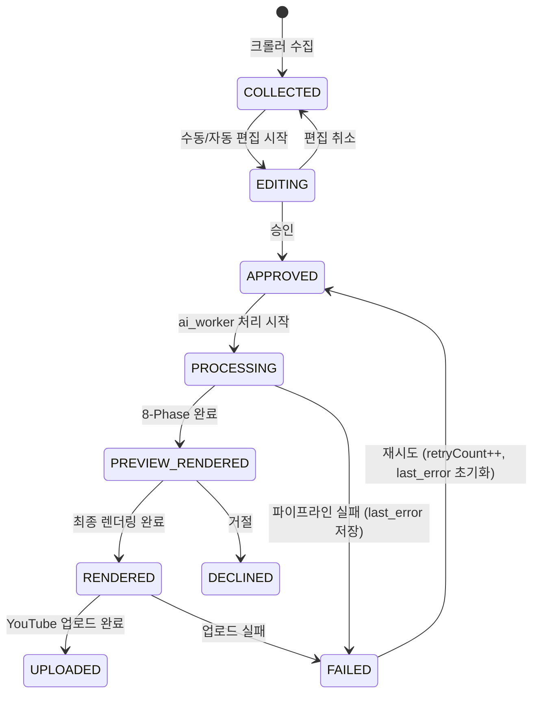

# WaggleBot — Post 상태 전이

> last-verified: 2026-06-12 (commit `656dffd`) · code-ref: `worker/db/models.py` PostStatus
> scope: Post 상태 머신 — SSOT

## 상태 전이 다이어그램

## 상태별 의미

| 상태 | 의미 | 진입 트리거 |
|------|------|-----------|
| `COLLECTED` | 크롤러가 저장한 원시 게시글 (수신함) | 크롤러 자동 수집 |
| `EDITING` | 수신함 승인 후 편집실 대기 | `POST /api/inbox/{id}/approve` |
| `APPROVED` | 편집 확인 완료, AI 처리 대기 | `POST /api/editor/{id}/confirm` |
| `PROCESSING` | ai_worker 8-Phase 실행 중 | ai_worker 폴링 시 자동 전환 |
| `PREVIEW_RENDERED` | 저화질 프리뷰 렌더링 완료 | 8-Phase 성공 |
| `RENDERED` | HD 렌더링 완료, 업로드 대기 | `POST /api/gallery/{id}/hd-render` Job |
| `UPLOADED` | YouTube 업로드 완료 (종착) | `POST /api/gallery/{id}/upload` Job |
| `DECLINED` | 운영자 거절 | `POST /api/inbox/{id}/decline` 또는 PREVIEW에서 거절 |
| `FAILED` | 처리 실패 (`last_error` 저장, `retry_count` 증가) | 파이프라인/업로드 예외 |

## 재시도 정책

- `MAX_RETRY_COUNT = 3` — 초과 시 영구 FAILED
- `POST /api/progress/{id}/retry` → `FAILED → APPROVED`, `retryCount++`, `last_error = null`
- 실패 원인은 `Post.last_error` 컬럼에 저장, Progress 페이지에서 최근 20건 조회 가능

> 처리 루프 동작(폴링 간격·하트비트·실패 처리) → [`docs/60-runtime/pipeline-runtime.md`](pipeline-runtime.md)
