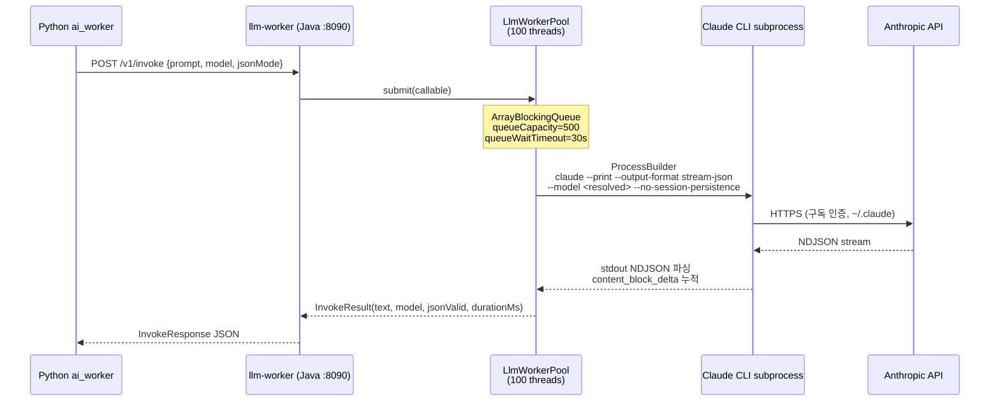

# WaggleBot — API 레퍼런스

## 서비스별 엔드포인트

| 서비스 | Base URL | 역할 |
|--------|----------|------|
| `llm-worker` | `http://llm-worker:8090` | Claude CLI 게이트웨이 (완전 구현) |
| `backend` | `http://backend:8080` | Spring Boot REST API (구현 예정) |
| `fish-speech` | `http://fish-speech:8080` | TTS 서비스 (외부 이미지) |
| `comfyui` | `http://comfyui:8188` | 비디오 생성 (외부 이미지) |

---

## llm-worker API (:8090)

### POST /v1/invoke

LLM 호출. Python `call_llm()` 함수가 이 엔드포인트를 사용.

**Request Body:**
```json
{
  "prompt": "처리할 텍스트 또는 질문",
  "systemPrompt": "시스템 프롬프트 (선택)",
  "model": "haiku",
  "jsonMode": false,
  "maxTokens": 2048,
  "temperature": 0.7,
  "callType": "chunk",
  "correlationId": "post-123-chunk",
  "timeoutMs": 0
}
```

| 필드 | 타입 | 기본값 | 설명 |
|------|------|--------|------|
| `prompt` | string | **필수** | 사용자 프롬프트 |
| `systemPrompt` | string | null | 시스템 프롬프트 |
| `model` | string | `claude-haiku-4-5-20251001` | 모델 별칭 또는 전체 ID |
| `jsonMode` | boolean | false | true 시 JSON 응답 강제 + 파싱 |
| `maxTokens` | int | 2048 | 최대 출력 토큰 (advisory) |
| `temperature` | float | 0.7 | 온도 (advisory — claude CLI 미지원) |
| `callType` | string | `raw` | 로깅용 레이블 |
| `correlationId` | string | null | 추적 ID |
| `timeoutMs` | long | 0 | 0=기본값(120초) |

**모델 별칭 매핑:**
| 별칭 | 실제 모델 ID |
|------|------------|
| `haiku` | `claude-haiku-4-5-20251001` |
| `sonnet` | `claude-sonnet-4-6` |
| `opus` | `claude-opus-4-8` |

**Response (200):**
```json
{
  "text": "LLM 응답 텍스트",
  "model": "claude-haiku-4-5-20251001",
  "jsonValid": false,
  "stopReason": "end_turn",
  "durationMs": 1234,
  "callType": "chunk",
  "correlationId": "post-123-chunk"
}
```

**에러 응답:**
| HTTP | 예외 | 원인 |
|------|------|------|
| 400 | IllegalArgumentException | prompt 누락 |
| 429 | QueueFullException | 큐 포화 (queueCapacity=500) |
| 502 | CliFailedException | Claude CLI 비정상 종료 |
| 504 | InvocationTimeoutException | 타임아웃 초과 |

### GET /healthz

서비스 헬스 체크.

**Response (200):**
```json
{"status": "ok"}
```

### GET /actuator/health

Spring Actuator 헬스. `ClaudeCliHealthIndicator` 포함 (`claude --version` 30초 캐싱).

---

## llm-worker 내부 동작



**JSON Mode 처리 흐름:**
```mermaid
flowchart LR
    J1[systemPrompt에<br/>JSON 지시문 추가] --> J2[LLM 응답 수신]
    J2 --> J3{코드펜스<br/>있음?}
    J3 -->|Yes| J4[정규식으로 추출<br/>```json ... ```]
    J3 -->|No| J5[중괄호 추출<br/>{ ... }]
    J4 & J5 --> J6{JSON.parse<br/>성공?}
    J6 -->|Yes| J7[jsonValid=true]
    J6 -->|No| J8[jsonValid=false<br/>text 그대로 반환]
```

---

## backend API (:8080) — 구현 예정

계획된 REST 엔드포인트 (Spring Boot Controller 미구현):

### Posts

| Method | Path | 설명 |
|--------|------|------|
| `GET` | `/api/posts` | 게시글 목록 (status 필터, 페이지네이션) |
| `GET` | `/api/posts/{id}` | 게시글 상세 + content |
| `PATCH` | `/api/posts/{id}/status` | 상태 변경 (APPROVED/DECLINED) |
| `GET` | `/api/posts/{id}/comments` | 댓글 목록 |

### Contents

| Method | Path | 설명 |
|--------|------|------|
| `GET` | `/api/contents/{postId}` | 콘텐츠 조회 (ScriptData 포함) |
| `PUT` | `/api/contents/{postId}/script` | 대본 수동 편집 |
| `POST` | `/api/contents/{postId}/approve` | 최종 승인 → 업로드 큐 등록 |

### Jobs

| Method | Path | 설명 |
|--------|------|------|
| `POST` | `/api/jobs` | 작업 생성 (dashboard_worker 큐 등록) |
| `GET` | `/api/jobs/{id}` | 작업 상태 조회 |

### LLM Logs

| Method | Path | 설명 |
|--------|------|------|
| `GET` | `/api/llm-logs` | LLM 호출 이력 (callType/postId 필터) |

### Analytics

| Method | Path | 설명 |
|--------|------|------|
| `GET` | `/api/analytics/summary` | 상태별 게시글 수, 성공률 |
| `GET` | `/api/analytics/performance` | YouTube 성과 지표 집계 |

### Settings

| Method | Path | 설명 |
|--------|------|------|
| `GET` | `/api/settings/pipeline` | pipeline.json 조회 |
| `PUT` | `/api/settings/pipeline` | pipeline.json 저장 |
| `GET` | `/api/settings/credentials` | 플랫폼 인증 정보 조회 |
| `PUT` | `/api/settings/credentials` | 플랫폼 인증 정보 저장 |

---

## Fish Speech API (:8082 외부, :8080 컨테이너 내부)

Python `fish_client.py`가 직접 호출. 공식 Fish Speech v1.5.1 API.

**주요 엔드포인트:**
```
POST /v1/tts
  Body: {text, reference_audio (base64), reference_text, format, temperature, repetition_penalty}
  Response: audio/wav binary
```

**설정값 (config/settings.py):**
- `FISH_SPEECH_TEMPERATURE = 0.5` (중국어 회귀 방지)
- `FISH_SPEECH_REPETITION_PENALTY = 1.3`
- `FISH_SPEECH_TIMEOUT = 120s`

---

## ComfyUI API (:8188)

Python `comfy_client.py`가 워크플로우 JSON 제출.

**주요 엔드포인트:**
```
POST /prompt            - 워크플로우 JSON 제출, prompt_id 반환
GET  /queue             - 큐 상태 조회
GET  /history/{prompt_id} - 완료된 작업 결과
GET  /system_stats      - GPU/VRAM 상태 (헬스체크)
```

**워크플로우 파일 위치:** `worker/ai_worker/video/workflows/` (ComfyUI와 볼륨 공유)
