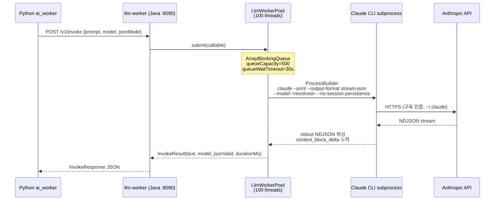

# WaggleBot — API 레퍼런스

## 서비스별 엔드포인트

| 서비스 | Base URL | 역할 |
|--------|----------|------|
| `llm-worker` | `http://llm-worker:8090` | Claude CLI 게이트웨이 (완전 구현) |
| `backend` | `http://backend:8080` | Spring Boot REST API (완전 구현) |
| `fish-speech` | `http://fish-speech:8080` | TTS 서비스 (외부 이미지) |
| `comfyui` | `http://comfyui:8188` | 비디오 생성 (외부 이미지) |

---

## llm-worker API (:8090)

### POST /v1/invoke

LLM 호출. Python `call_llm()` 함수가 이 엔드포인트를 사용.

**Request Body:**
```json
{
  "prompt": "처리할 텍스트 또는 질문",
  "systemPrompt": "시스템 프롬프트 (선택)",
  "model": "haiku",
  "jsonMode": false,
  "maxTokens": 2048,
  "temperature": 0.7,
  "callType": "chunk",
  "correlationId": "post-123-chunk",
  "timeoutMs": 0
}
```

| 필드 | 타입 | 기본값 | 설명 |
|------|------|--------|------|
| `prompt` | string | **필수** | 사용자 프롬프트 |
| `systemPrompt` | string | null | 시스템 프롬프트 |
| `model` | string | `claude-haiku-4-5-20251001` | 모델 별칭 또는 전체 ID |
| `jsonMode` | boolean | false | true 시 JSON 응답 강제 + 파싱 |
| `maxTokens` | int | 2048 | 최대 출력 토큰 (advisory) |
| `temperature` | float | 0.7 | 온도 (advisory — claude CLI 미지원) |
| `callType` | string | `raw` | 로깅용 레이블 |
| `correlationId` | string | null | 추적 ID |
| `timeoutMs` | long | 0 | 0=기본값(120초) |

**모델 별칭 매핑:**
| 별칭 | 실제 모델 ID |
|------|------------|
| `haiku` | `claude-haiku-4-5-20251001` |
| `sonnet` | `claude-sonnet-4-6` |
| `opus` | `claude-opus-4-8` |

**Response (200):**
```json
{
  "text": "LLM 응답 텍스트",
  "model": "claude-haiku-4-5-20251001",
  "jsonValid": false,
  "stopReason": "end_turn",
  "durationMs": 1234,
  "callType": "chunk",
  "correlationId": "post-123-chunk"
}
```

**에러 응답:**
| HTTP | 예외 | 원인 |
|------|------|------|
| 400 | IllegalArgumentException | prompt 누락 |
| 429 | QueueFullException | 큐 포화 (queueCapacity=500) |
| 502 | CliFailedException | Claude CLI 비정상 종료 |
| 504 | InvocationTimeoutException | 타임아웃 초과 |

### GET /healthz

서비스 헬스 체크.

**Response (200):**
```json
{"status": "ok"}
```

### GET /actuator/health

Spring Actuator 헬스. `ClaudeCliHealthIndicator` 포함 (`claude --version` 30초 캐싱).

---

## llm-worker 내부 동작



**JSON Mode 처리 흐름:**
```mermaid
flowchart LR
    J1[systemPrompt에<br/>JSON 지시문 추가] --> J2[LLM 응답 수신]
    J2 --> J3{코드펜스<br/>있음?}
    J3 -->|Yes| J4[정규식으로 추출<br/>```json ... ```]
    J3 -->|No| J5[중괄호 추출<br/>{ ... }]
    J4 & J5 --> J6{JSON.parse<br/>성공?}
    J6 -->|Yes| J7[jsonValid=true]
    J6 -->|No| J8[jsonValid=false<br/>text 그대로 반환]
```

---

## backend API (:8080) — 구현 완료

Spring Boot 3.3 REST API. 전체 Controller 구현 완료.

### Inbox (`/api/inbox`)

| Method | Path | 설명 |
|--------|------|------|
| `GET` | `/api/inbox` | COLLECTED 게시글 목록 (engagementScore 내림차순, 페이지네이션) + tier1/2/3 카운트 |
| `POST` | `/api/inbox/{id}/approve` | COLLECTED → EDITING + GENERATE_SCRIPT Job 생성 |
| `POST` | `/api/inbox/{id}/decline` | → DECLINED |
| `POST` | `/api/inbox/batch` | 배치 승인/거절. 응답: `{processed, failed:[{id,error}], action}` |
| `POST` | `/api/inbox/{id}/analyze` | AI_FITNESS Job 생성 (게시글 적합성 분석) |
| `POST` | `/api/inbox/crawl` | MANUAL_CRAWL Job 생성 |
| `GET` | `/api/inbox/jobs/{jobId}` | Job 상태 폴링 |

### Editor (`/api/editor`)

| Method | Path | 설명 |
|--------|------|------|
| `GET` | `/api/editor` | EDITING 게시글 목록 |
| `GET` | `/api/editor/{id}` | 게시글 + ScriptData + 설정 제약값 |
| `PUT` | `/api/editor/{id}/script` | 대본 수동 저장 (ScriptDataDto) |
| `POST` | `/api/editor/{id}/generate` | GENERATE_SCRIPT Job 생성 (model/extra_instructions 선택) |
| `POST` | `/api/editor/{id}/tts-preview` | TTS_PREVIEW Job 생성 |
| `POST` | `/api/editor/{id}/confirm` | EDITING → APPROVED (최종 확인) |
| `GET` | `/api/editor/jobs/{jobId}` | Job 상태 폴링 |

### Gallery (`/api/gallery`)

| Method | Path | 설명 |
|--------|------|------|
| `GET` | `/api/gallery` | PREVIEW_RENDERED/RENDERED/UPLOADED 게시글 목록 (updatedAt 내림차순) + Content |
| `POST` | `/api/gallery/{id}/hd-render` | HD_RENDER Job 생성 |
| `POST` | `/api/gallery/{id}/upload` | UPLOAD Job 생성 (platform 선택) |

### Progress (`/api/progress`)

| Method | Path | 설명 |
|--------|------|------|
| `GET` | `/api/progress` | 전체 상태별 카운트 + PROCESSING 목록 + FAILED 목록(최근 20건, lastError 포함) |
| `POST` | `/api/progress/{id}/retry` | FAILED → APPROVED, retryCount++, lastError=null |

### Analytics (`/api/analytics`)

| Method | Path | 설명 |
|--------|------|------|
| `GET` | `/api/analytics/funnel` | 상태별 게시글 카운트 |
| `POST` | `/api/analytics/youtube/fetch` | FETCH_YT_ANALYTICS Job 생성 |
| `POST` | `/api/analytics/insights` | AI_INSIGHT Job 생성 (LLM 인사이트) |
| `POST` | `/api/analytics/feedback/apply` | FEEDBACK_APPLY Job 생성 |
| `GET` | `/api/analytics/jobs/{jobId}` | Job 상태 폴링 |

### LLM Logs (`/api/llm-logs`)

| Method | Path | 설명 |
|--------|------|------|
| `GET` | `/api/llm-logs` | LLM 호출 이력 (callType/postId/success 필터, createdAt 내림차순, 페이지네이션) |
| `GET` | `/api/llm-logs/{id}` | 단건 조회 |

### Settings (`/api/settings`)

| Method | Path | 설명 |
|--------|------|------|
| `GET` | `/api/settings` | pipeline.json 전체 조회 |
| `PUT` | `/api/settings` | pipeline.json 저장 |
| `GET` | `/api/settings/credentials` | 인증 정보 조회 (시크릿 마스킹) |
| `PUT` | `/api/settings/credentials` | 인증 정보 저장 |

### Media (`/api/media`)

정적 파일 서빙 — `/app/media/` 경로의 오디오/비디오/썸네일 파일을 HTTP로 노출.

---

## Fish Speech API (:8082 외부, :8080 컨테이너 내부)

Python `fish_client.py`가 직접 호출. 공식 Fish Speech v1.5.1 API.

**주요 엔드포인트:**
```
POST /v1/tts
  Body: {text, reference_audio (base64), reference_text, format, temperature, repetition_penalty}
  Response: audio/wav binary
```

**설정값 (config/settings.py):**
- `FISH_SPEECH_TEMPERATURE = 0.5` (중국어 회귀 방지)
- `FISH_SPEECH_REPETITION_PENALTY = 1.3`
- `FISH_SPEECH_TIMEOUT = 120s`

---

## ComfyUI API (:8188)

Python `comfy_client.py`가 워크플로우 JSON 제출.

**주요 엔드포인트:**
```
POST /prompt            - 워크플로우 JSON 제출, prompt_id 반환
GET  /queue             - 큐 상태 조회
GET  /history/{prompt_id} - 완료된 작업 결과
GET  /system_stats      - GPU/VRAM 상태 (헬스체크)
```

**워크플로우 파일 위치:** `worker/ai_worker/video/workflows/` (ComfyUI와 볼륨 공유)
