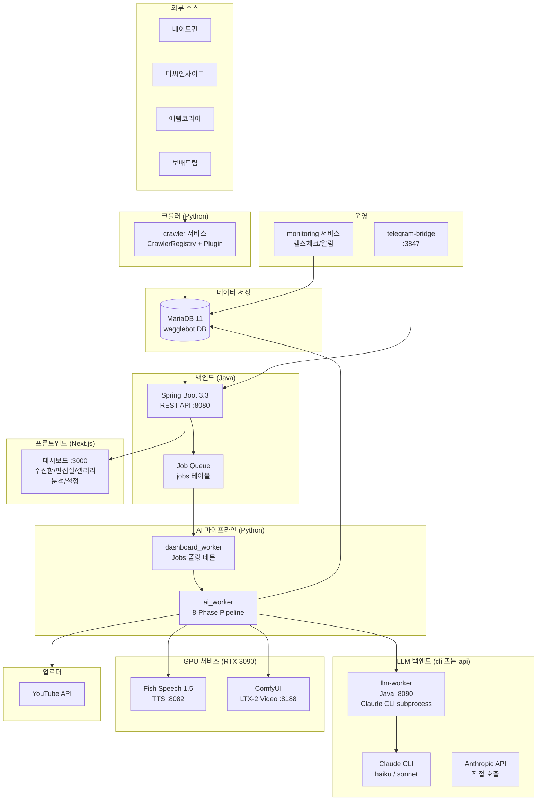
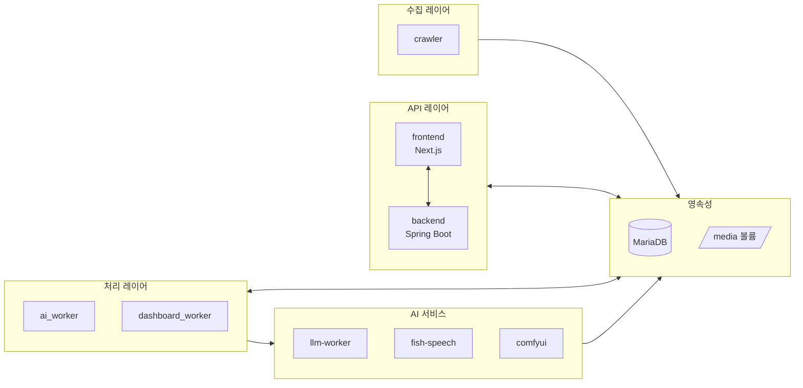
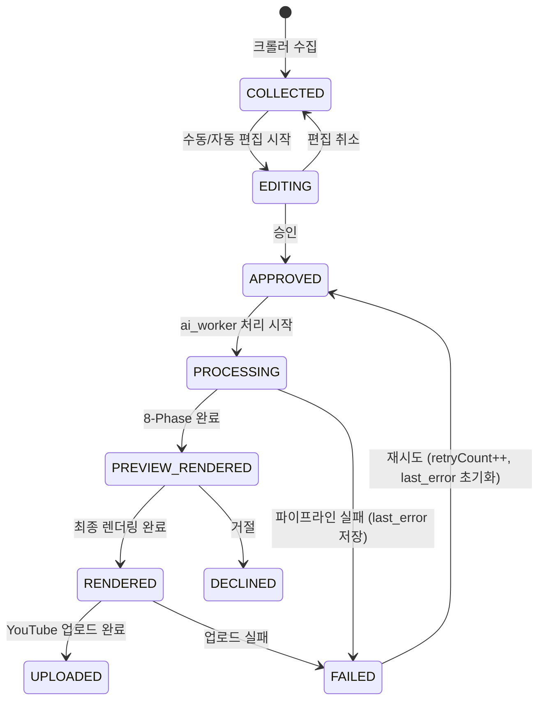
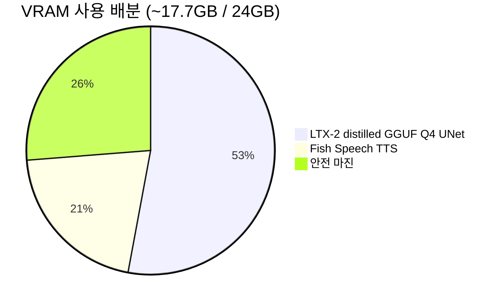

# WaggleBot — 시스템 아키텍처

> **last-verified:** 2026-06-11 (commit `3ba0d15`)
> **scope:** 시스템 구조, Post 상태 전이, VRAM 배분 — SSOT

커뮤니티 게시글을 자동으로 크롤링해 LLM 대본→TTS→비디오→업로드까지 처리하는 AI 컨텐츠 자동화 파이프라인.

## 전체 시스템 흐름

## 서비스 레이어 구조

## Post 상태 전이

## GPU VRAM 배분 (RTX 3090 24GB)

> Gemma-3-12B 텍스트 인코더(~15GB)는 `--lowvram` 플래그로 CPU에서 실행 (VRAM 미사용).

## 기술 스택 요약

| 영역 | 기술 |
|------|------|
| **크롤러** | Python 3.12, aiohttp, BeautifulSoup |
| **백엔드** | Java 21, Spring Boot 3.3, MariaDB 11, Flyway |
| **프론트엔드** | Next.js 14 (App Router), TypeScript |
| **LLM 게이트웨이** | Java 21, Spring Boot 3.3, Claude CLI subprocess |
| **LLM** | Claude haiku-4-5 / sonnet-4-6 — CLI 백엔드(구독) 또는 API 백엔드(`ANTHROPIC_API_KEY`) |
| **TTS** | Fish Speech v1.5.1 (zero-shot 클로닝) |
| **비디오** | ComfyUI + LTX-2 19B distilled GGUF Q4 (8-step) |
| **렌더링** | FFmpeg (h264_nvenc) |
| **컨테이너** | Docker Compose, NVIDIA Container Runtime |
| **DB** | MariaDB 11, SQLAlchemy (Python), JPA/Hibernate (Java) |
