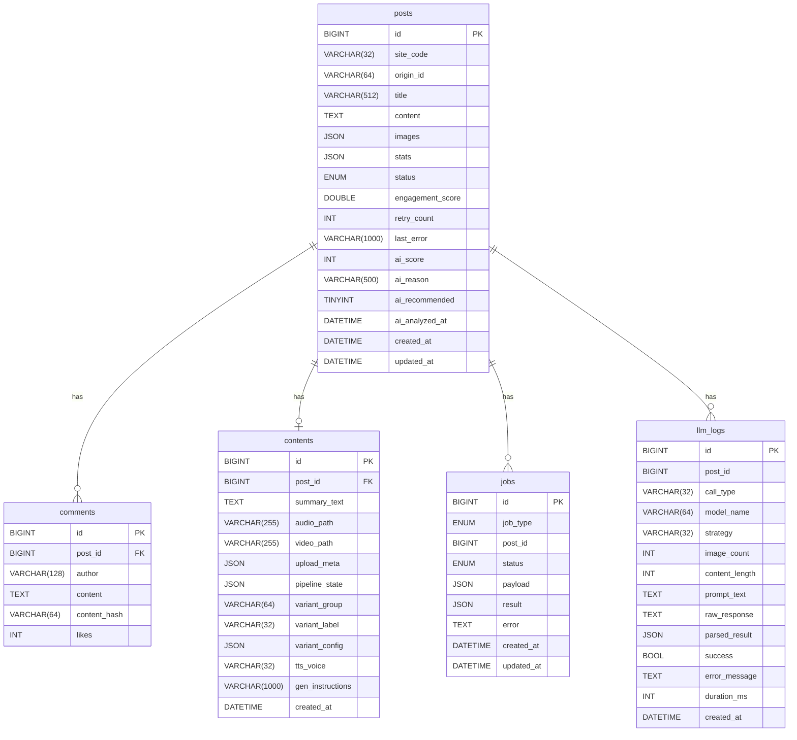

# WaggleBot — 데이터베이스 스키마

> **last-verified:** 2026-06-11 (commit `3ba0d15`)
> **scope:** DB 스키마, SQLAlchemy 패턴, ScriptData JSON 구조 — SSOT

DB: MariaDB 11, 데이터베이스명: `wagglebot`

## ER 다이어그램



## 테이블 상세

### posts
게시글 원본 데이터. 크롤러가 수집, 파이프라인의 핵심 입력.

| 컬럼 | 타입 | 설명 |
|------|------|------|
| `id` | BIGINT PK | 자동 증가 |
| `site_code` | VARCHAR(32) | 출처 사이트 코드 (nate_pann, dcinside 등) |
| `origin_id` | VARCHAR(64) | 원본 사이트의 게시글 ID (중복 방지) |
| `title` | VARCHAR(512) | 게시글 제목 |
| `content` | TEXT | 게시글 본문 |
| `images` | JSON | 이미지 URL 배열 |
| `stats` | JSON | 조회수/좋아요/댓글 수 등 원본 통계 |
| `status` | ENUM | `COLLECTED→EDITING→APPROVED→PROCESSING→PREVIEW_RENDERED→RENDERED→UPLOADED` |
| `engagement_score` | DOUBLE | 스코어링: `조회×0.1 + 좋아요×2.0 + 댓글×1.5 + 베스트공감×0.5`, 6시간 반감기 |
| `retry_count` | INT | 파이프라인 재시도 횟수 (MAX=3) |
| `last_error` | VARCHAR(1000) | 마지막 파이프라인 실패 원인 (`repr(exc)[:1000]`). 재시도 시 NULL 초기화 |
| `ai_score` | INT | AI 옥석판별 점수 (0~100). `ai_fitness` 잡 결과 |
| `ai_reason` | VARCHAR(500) | AI 점수 산정 이유 |
| `ai_recommended` | TINYINT(1) | AI 추천 여부 (1=추천, 0=비추천) |
| `ai_analyzed_at` | DATETIME | AI 분석 완료 시각 |

**인덱스:** `status + engagement_score DESC` (처리 대기 조회용), `status + ai_score` (AI 필터링용)

### comments
게시글의 댓글. Phase 2 LLM 청킹 시 컨텍스트로 활용.

| 컬럼 | 타입 | 설명 |
|------|------|------|
| `post_id` | BIGINT FK | posts.id 참조 |
| `author` | VARCHAR(128) | 댓글 작성자 닉네임 |
| `content` | TEXT | 댓글 내용 |
| `content_hash` | VARCHAR(64) | SHA-256 해시 (중복 댓글 방지) |
| `likes` | INT | 공감 수 |

**조회:** `findByPostIdOrderByLikesDesc` — 인기 댓글 우선 정렬

### contents
파이프라인 처리 결과. Post 당 1개 (1:1).

| 컬럼 | 타입 | 설명 |
|------|------|------|
| `post_id` | BIGINT UK FK | posts.id (unique) |
| `summary_text` | TEXT | **ScriptData JSON** 저장. 문자열이면 레거시 평문 |
| `audio_path` | VARCHAR(255) | 최종 합성 오디오 경로 |
| `video_path` | VARCHAR(255) | 최종 영상 경로 |
| `upload_meta` | JSON | 업로드 플랫폼별 메타데이터 (YouTube 영상 ID 등) |
| `pipeline_state` | JSON | 파이프라인 단계별 상태 스냅샷 |
| `variant_group` | VARCHAR(64) | A/B 테스트 그룹 |
| `variant_label` | VARCHAR(32) | A/B 테스트 레이블 |
| `variant_config` | JSON | A/B 테스트 설정값 |
| `tts_voice` | VARCHAR(32) | 게시글별 TTS 음성 키 (없으면 pipeline.json 기본값 사용) |
| `gen_instructions` | VARCHAR(1000) | 에디터에서 대본 재생성 시 사용한 추가 지시문 |

**ScriptData 구조 (summary_text JSON):**
```json
{
  "scenes": [
    {
      "scene_id": 1,
      "type": "intro",
      "mood": "humor",
      "video_mode": "t2v",
      "text_lines": [
        {"text": "후킹 문장", "audio": "/media/audio/scene1_0.wav"}
      ],
      "video_prompt": "English video prompt for LTX-2",
      "video_clip_path": "/media/tmp/videos/scene1.mp4"
    }
  ],
  "title": "썸네일 제목",
  "total_duration": 62.5
}
```

### jobs
`backend` → `dashboard_worker` 비동기 작업 큐.

| 컬럼 | 타입 | 설명 |
|------|------|------|
| `job_type` | ENUM | `PROCESS_POST`, `UPLOAD`, `REGENERATE_SCRIPT`, ... |
| `post_id` | BIGINT | 대상 게시글 ID |
| `status` | ENUM | `PENDING → RUNNING → DONE / FAILED` |
| `payload` | JSON | 작업 파라미터 |
| `result` | JSON | 처리 결과 |
| `error` | TEXT | 실패 시 에러 메시지 |

**처리 흐름:** Java backend가 PENDING 레코드 INSERT → `dashboard_worker`가 폴링 후 Python에서 실행

### llm_logs
LLM 호출 이력. 디버깅/비용 분석용.

| 컬럼 | 타입 | 설명 |
|------|------|------|
| `call_type` | VARCHAR(32) | `chunk / generate_script / scene_director / video_prompt / feedback` |
| `model_name` | VARCHAR(64) | 실제 사용 모델 ID |
| `strategy` | VARCHAR(32) | 라우팅 전략 (`pick_model` 결과) |
| `image_count` | INT | 프롬프트에 포함된 이미지 수 |
| `content_length` | INT | 입력 텍스트 길이 |
| `prompt_text` | TEXT | 전체 프롬프트 (DEBUG용) |
| `raw_response` | TEXT | 원본 LLM 응답 |
| `parsed_result` | JSON | 파싱된 구조화 데이터 |
| `success` | BOOL | 성공 여부 |
| `duration_ms` | INT | 응답 시간 (ms) |

## Java Repository 메서드

```java
// PostRepository
List<Post> findByStatusOrderByEngagementScoreDesc(PostStatus status);
long countByStatus(PostStatus status);
List<Post> findTop20ByStatusOrderByUpdatedAtDesc(PostStatus status);  // FAILED 최근 20건

// ContentRepository
Optional<Content> findByPostId(Long postId);

// JobRepository
Optional<Job> findTopByStatusOrderByCreatedAtAsc(JobStatus status);  // FIFO 큐
List<Job> findByPostIdAndJobTypeOrderByCreatedAtDesc(Long postId, JobType jobType);

// CommentRepository
List<Comment> findByPostIdOrderByLikesDesc(Long postId);

// LlmLogRepository
Page<LlmLog> findByCallType(String callType, Pageable pageable);
Page<LlmLog> findByPostId(Long postId, Pageable pageable);
Page<LlmLog> findBySuccess(Boolean success, Pageable pageable);
```

## Python SQLAlchemy 사용 패턴

```python
# 반드시 with 블록 사용 (세션 자동 close)
with SessionLocal() as db:
    post = db.query(Post).filter_by(status=PostStatus.APPROVED).first()
    content = db.query(Content).filter_by(post_id=post.id).first()
```

## 설정

```
DATABASE_URL=mysql+pymysql://wagglebot:wagglebot@db/wagglebot   # Python
SPRING_DATASOURCE_URL=jdbc:mariadb://db:3306/wagglebot          # Java
```
