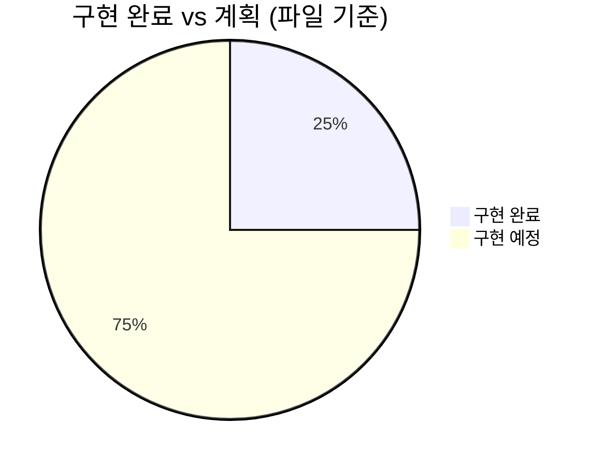
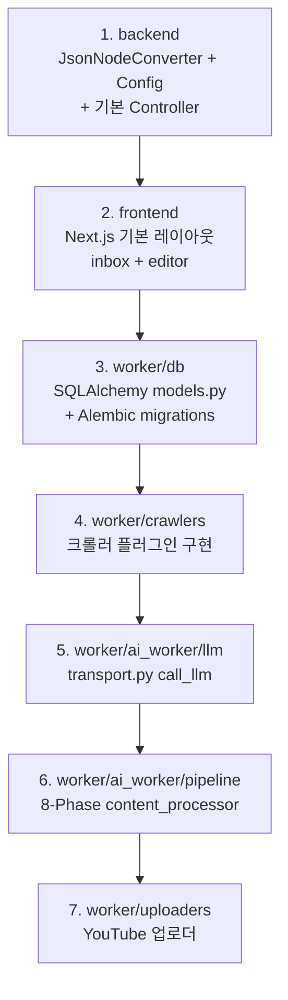

# WaggleBot — 구현 현황

현재 코드베이스의 구현 완료/미완료 상태 정리. (2026-06-09 기준)

## 전체 현황 요약



## 서비스별 상태

| 서비스 | 상태 | 구현 범위 |
|--------|------|-----------|
| `llm-worker` | ✅ 완전 구현 | Claude CLI 게이트웨이 19개 파일 |
| `backend` domain | ✅ 완전 구현 | JPA 엔티티 5개 + Repository |
| `config/settings.py` | ✅ 완전 구현 | Python 설정 허브 |
| `env/docker-compose.yml` | ✅ 완전 구현 | 전체 서비스 오케스트레이션 |
| `backend` service layer | ⬜ 미구현 | Controller, Service, Config 없음 |
| `frontend` | ⬜ 미구현 | 라우트 디렉토리만 존재, .tsx 없음 |
| `worker/` Python | ⬜ 미구현 | ai_worker, crawler, TTS, video 없음 |
| `telegram-bridge` | ⬜ 미구현 | docker-compose 참조만 있음 |

---

## ✅ 구현 완료

### llm-worker (`llm-worker/`)

```
llm-worker/src/main/java/com/wagglebot/llmworker/
├── LlmWorkerApplication.java          ✅ 엔트리포인트
├── cli/ClaudeCliInvoker.java          ✅ Claude CLI subprocess 실행 + NDJSON 파싱
├── config/LlmWorkerProperties.java    ✅ @ConfigurationProperties
├── controller/InvokeController.java   ✅ POST /v1/invoke, GET /healthz
├── dto/InvokeRequest.java             ✅ 요청 DTO
├── dto/InvokeResponse.java            ✅ 응답 DTO
├── exception/CliFailedException.java  ✅ HTTP 502
├── exception/GlobalExceptionHandler.java ✅ 에러 매핑
├── exception/InvocationTimeoutException.java ✅ HTTP 504
├── exception/QueueFullException.java  ✅ HTTP 429
├── health/ClaudeCliHealthIndicator.java ✅ Actuator 헬스
├── pool/LlmWorkerPool.java            ✅ ThreadPoolExecutor (100 threads, 500 queue)
└── service/InvocationService.java     ✅ 서비스 레이어
```

### backend domain (`backend/src/main/java/com/wagglebot/domain/`)

```
├── Post.java            ✅ @Entity + PostStatus enum
├── PostRepository.java  ✅ JpaRepository + JpaSpecificationExecutor
├── Content.java         ✅ @Entity (ScriptData JSON 저장)
├── ContentRepository.java ✅
├── Comment.java         ✅ @Entity
├── CommentRepository.java ✅
├── Job.java             ✅ @Entity + JobType/JobStatus enum
├── JobRepository.java   ✅
├── LlmLog.java          ✅ @Entity
└── LlmLogRepository.java ✅
```

### 설정 파일

```
config/
├── settings.py          ✅ Python 설정 허브 (완전 구현)
├── layout.json          ✅ 렌더러 레이아웃 (참조됨)
├── scene_policy.json    ✅ 씬 정책 (참조됨)
├── video_styles.json    ✅ 비디오 스타일 (참조됨)
env/
└── docker-compose.yml   ✅ 전체 서비스 정의
```

---

## ⬜ 구현 예정

### backend service layer

```
backend/src/main/java/com/wagglebot/
├── common/converter/JsonNodeConverter.java  ⬜ JPA JSON 컨버터 (엔티티에서 참조)
├── config/                                  ⬜ Spring 설정 (JPA, CORS, Security 등)
├── controller/                              ⬜ REST 컨트롤러
│   ├── PostController.java
│   ├── ContentController.java
│   ├── JobController.java
│   ├── LlmLogController.java
│   └── SettingsController.java
├── exception/                               ⬜ GlobalExceptionHandler
├── job/                                     ⬜ Job 관련 서비스
└── settings/                               ⬜ 설정 서비스
backend/src/main/resources/db/migration/     ⬜ Flyway 마이그레이션 SQL
```

### frontend (`frontend/`)

```
frontend/
├── app/(admin)/admin/
│   ├── inbox/page.tsx         ⬜ 수신함 (COLLECTED 게시글 목록)
│   ├── editor/[postId]/page.tsx ⬜ 편집실 (대본 수정 + 승인)
│   ├── gallery/page.tsx       ⬜ 갤러리 (완성 콘텐츠)
│   ├── progress/page.tsx      ⬜ 처리 진행 현황
│   ├── analytics/page.tsx     ⬜ 성과 분석
│   ├── llm-logs/page.tsx      ⬜ LLM 호출 이력
│   └── settings/page.tsx      ⬜ 파이프라인 설정
├── components/
│   ├── admin/shell/           ⬜ 레이아웃 쉘 (Sidebar, Header)
│   └── ui/                    ⬜ 공용 UI 컴포넌트
└── lib/
    ├── api/                   ⬜ Backend API 클라이언트
    ├── hooks/                 ⬜ React 훅
    ├── store/                 ⬜ 상태 관리 (Zustand 예상)
    └── types/                 ⬜ TypeScript 타입 정의
```

### Python worker (`worker/`)

CLAUDE.md에 설계된 전체 Python 파이프라인이 미구현 상태.

```
worker/
├── Dockerfile                        ⬜
├── main.py                           ⬜ (크롤러 진입점)
├── crawlers/
│   ├── base.py                       ⬜ retry + 스코어링
│   ├── nate_pann.py                  ⬜
│   ├── bobaedream.py                 ⬜
│   ├── dcinside.py                   ⬜
│   ├── fmkorea.py                    ⬜
│   └── plugin_manager.py             ⬜
├── db/
│   ├── models.py                     ⬜ SQLAlchemy 모델
│   ├── session.py                    ⬜ SessionLocal
│   └── migrations/                   ⬜ Alembic
├── ai_worker/
│   ├── core/main.py                  ⬜ ai_worker 진입점
│   ├── processor.py                  ⬜ 처리 루프
│   ├── gpu_manager.py                ⬜ VRAM 세마포어
│   ├── llm/transport.py              ⬜ call_llm() / call_llm_raw()
│   ├── script/                       ⬜ LLM 스크립트 생성
│   ├── tts/                          ⬜ Fish Speech / Edge TTS
│   ├── video/                        ⬜ ComfyUI LTX-2
│   ├── renderer/                     ⬜ FFmpeg 렌더링
│   └── pipeline/                     ⬜ 8-Phase content_processor
├── uploaders/                        ⬜ YouTube 업로더
├── analytics/                        ⬜ 성과 수집 + 피드백
├── monitoring/                       ⬜ 헬스체크 데몬
└── dashboard_worker/                 ⬜ Job 폴링 데몬
```

### telegram-bridge (`telegram/`)

```
telegram/
├── Dockerfile                        ⬜
└── (봇 소스코드)                      ⬜
```

---

## 다음 구현 우선순위 (권장 순서)


