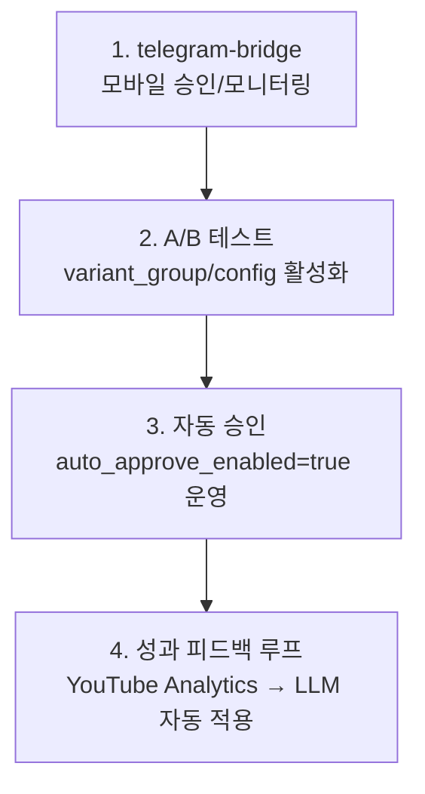

# WaggleBot — 구현 현황

현재 코드베이스의 구현 완료/미완료 상태 정리. (2026-06-10 기준)

## 전체 현황 요약

전체 파이프라인(크롤링→AI 처리→렌더링→업로드) 구현 완료. 대시보드 UI·REST API·Python 워커 전체 운영 가능.

| 서비스 | 상태 | 비고 |
|--------|------|------|
| `llm-worker` | ✅ 완전 구현 | Claude CLI 게이트웨이 |
| `backend` | ✅ 완전 구현 | 전체 Controller + Domain + Service |
| `frontend` | ✅ 완전 구현 | 7개 어드민 페이지 + 공용 컴포넌트 |
| `worker/crawlers` | ✅ 완전 구현 | 4개 사이트 플러그인 + 플러그인 매니저 |
| `worker/ai_worker` | ✅ 완전 구현 | 8-Phase 파이프라인 전체 |
| `worker/db` | ✅ 완전 구현 | SQLAlchemy 모델 + 마이그레이션 |
| `worker/uploaders` | ✅ 완전 구현 | YouTube 업로더 |
| `worker/analytics` | ✅ 완전 구현 | 성과 수집 + LLM 피드백 루프 |
| `worker/monitoring` | ✅ 완전 구현 | 헬스체크 + 알림 데몬 |
| `worker/dashboard_worker` | ✅ 완전 구현 | Job 폴링 실행 데몬 |
| `config/` | ✅ 완전 구현 | settings.py + JSON 설정 파일 전체 |
| `env/` | ✅ 완전 구현 | docker-compose.yml + Dockerfile 전체 |
| `telegram-bridge` | ⬜ 선택 구현 | 모바일 제어 브리지 (선택 사항) |

---

## ✅ 구현 완료

### backend (`backend/`)

```
src/main/java/com/wagglebot/
├── WagglebotApplication.java
├── common/
│   ├── JobStatus.java / JobType.java / PostStatus.java
│   ├── ScriptDataDto.java / ScriptDataMapper.java
│   └── converter/JsonNodeConverter.java         ✅ JPA JSON 컨버터
├── config/CorsConfig.java                       ✅ CORS 설정
├── controller/
│   ├── InboxController.java                     ✅ 수신함 CRUD + 배치 + Job 폴링
│   ├── EditorController.java                    ✅ 편집실 + TTS 프리뷰 + 대본 저장
│   ├── GalleryController.java                   ✅ 갤러리 목록 + HD 렌더 + 업로드
│   ├── ProgressController.java                  ✅ 처리 현황 + FAILED 목록 + 재시도
│   ├── AnalyticsController.java                 ✅ 퍼널 + YouTube 지표 + LLM 인사이트
│   ├── LlmLogController.java                    ✅ LLM 이력 조회
│   ├── SettingsController.java                  ✅ pipeline.json + credentials 관리
│   └── MediaController.java                     ✅ 미디어 파일 서빙
├── domain/
│   ├── Post.java + PostRepository.java          ✅ (last_error 컬럼 포함)
│   ├── Content.java + ContentRepository.java    ✅
│   ├── Comment.java + CommentRepository.java    ✅
│   ├── Job.java + JobRepository.java            ✅
│   └── LlmLog.java + LlmLogRepository.java      ✅
├── exception/GlobalExceptionHandler.java        ✅
├── job/JobService.java                          ✅ Job 큐 CRUD
└── settings/SettingsService.java                ✅ pipeline.json / credentials.json R/W
resources/db/migration/
├── V1__jobs_table.sql                           ✅ Flyway 자동 적용
└── V2__base_schema.sql                          ✅
```

### frontend (`frontend/`)

```
app/(admin)/admin/
├── inbox/page.tsx          ✅ 게시글 목록 + 티어 필터 + 배치 승인/거절 + toast 피드백
├── editor/page.tsx         ✅ EDITING 목록
├── editor/[postId]/page.tsx ✅ 대본 편집 + TTS 미리듣기 + Job 폴링
├── gallery/page.tsx        ✅ 썸네일 목록 + 9:16 풀스크린 모달 + HD렌더/업로드
├── progress/page.tsx       ✅ 상태 카운트 + PROCESSING(멈춤 배지) + FAILED(오류 표시 + 재시도)
├── analytics/page.tsx      ✅ 퍼널 차트 + YouTube 지표
├── llm-logs/page.tsx       ✅ LLM 호출 이력 테이블
└── settings/page.tsx       ✅ pipeline.json 폼 편집
components/
├── admin/shell/            ✅ Sidebar + Header
├── admin/AdminStatCard     ✅
├── admin/AdminSection      ✅
└── ui/                     ✅ button/badge/toast/dialog 등 shadcn 기반
lib/
├── api/                    ✅ inbox/editor/gallery/progress/analytics/llm-logs/settings API 클라이언트
├── hooks/                  ✅
└── types/index.ts          ✅ Post/Content/Job/LlmLog TypeScript 타입 (lastError 포함)
```

### worker (`worker/`)

```
worker/
├── main.py                              ✅ 크롤러 진입점
├── crawlers/
│   ├── base.py                          ✅ retry + engagement score 스코어링 + 6시간 반감기
│   ├── nate_pann.py                     ✅
│   ├── bobaedream.py                    ✅
│   ├── dcinside.py                      ✅
│   ├── fmkorea.py                       ✅
│   └── plugin_manager.py               ✅ CrawlerRegistry 동적 조회
├── db/
│   ├── models.py                        ✅ Post/Comment/Content/LLMLog/ScriptData + last_error
│   ├── session.py                       ✅ SessionLocal
│   └── migrations/                      ✅ 006개 SQL + runner.py
├── ai_worker/
│   ├── core/
│   │   ├── main.py                      ✅ 진입점 + _mark_post_failed(last_error 저장)
│   │   ├── processor.py                 ✅ APPROVED 폴링 루프
│   │   ├── gpu_manager.py               ✅ VRAM 세마포어 + nvidia-smi 연동
│   │   └── shutdown.py                  ✅ 그레이스풀 종료
│   ├── llm/transport.py                 ✅ call_llm/call_llm_raw/pick_model (CLI·API 백엔드 분기)
│   ├── script/
│   │   ├── client.py                    ✅ generate_script + _SCRIPT_SYSTEM 프롬프트
│   │   ├── chunker.py                   ✅ chunk_with_llm
│   │   ├── logger.py                    ✅
│   │   └── (parser, normalizer)         ✅
│   ├── scene/
│   │   ├── director.py                  ✅ SceneDirector + assign_video_modes
│   │   ├── validator.py                 ✅ validate_and_fix
│   │   └── analyzer.py                  ✅ analyze_resources → ResourceProfile
│   ├── pipeline/content_processor.py   ✅ Phase 1~8 통합 (Phase 5∥6 asyncio.gather)
│   ├── tts/
│   │   ├── fish_client.py               ✅ synthesize + 워밍업 센티널 스킵
│   │   ├── normalizer.py                ✅ 한국어 전처리
│   │   └── number_reader.py             ✅ 숫자 읽기
│   ├── video/
│   │   ├── manager.py                   ✅ 비디오 클립 오케스트레이션 + 4단계 폴백
│   │   ├── comfy_client.py              ✅ ComfyUI API + 적응형 폴링 + 워크플로우 캐시
│   │   ├── prompt_engine.py             ✅ 한→영 프롬프트 변환
│   │   ├── image_filter.py              ✅ I2V 적합성 점수
│   │   ├── video_utils.py               ✅ FFmpeg 후처리 + 프레임/해상도 검증
│   │   └── workflows/                   ✅ ComfyUI 워크플로우 JSON
│   └── renderer/
│       ├── composer.py                  ✅ 진입점
│       ├── layout.py                    ✅ 오케스트레이터 (concat 후 seg 즉시 정리)
│       ├── _frames.py                   ✅ PNG 프레임 생성 + MD5 오버레이 캐시
│       ├── _tts.py                      ✅ TTS 오디오 합성
│       ├── _encode.py                   ✅ 단일 NVENC 인코딩 (filter_complex 통합)
│       └── thumbnail.py                 ✅
├── llm/                                 ✅ llm-worker Spring Boot 소스 (별도 빌드)
├── uploaders/
│   ├── base.py                          ✅ UploaderRegistry
│   └── youtube.py                       ✅ YouTube Data API v3
├── analytics/
│   ├── collector.py                     ✅ YouTube Analytics 수집
│   └── feedback.py                      ✅ LLM 인사이트 → feedback_config.json
├── dashboard_worker/
│   ├── main.py                          ✅ Job 폴링 루프
│   └── handlers.py                      ✅ JobType별 핸들러 (TTS_PREVIEW synthesize 사용)
├── monitoring/
│   ├── alerting.py                      ✅
│   └── daemon.py                        ✅
├── test/
│   └── test_e2e_structure_improve.py    ✅ 21 unit + 5 integration 테스트
└── pytest.ini                           ✅ 마커 등록
```

---

## ⬜ 선택 구현 / 미완료

### telegram-bridge (`telegram/`)

모바일 원격 제어 브리지. 선택 사항 — `docker-compose.yml`에 서비스 정의는 존재.

```
telegram/
├── Dockerfile               ⬜ (미구현)
└── (봇 소스코드)              ⬜
```

---

## 다음 개선 우선순위

현 상태로 전체 파이프라인이 동작 가능하며 아래는 선택적 개선 항목:


