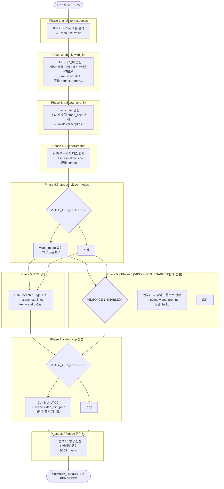
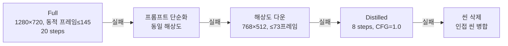
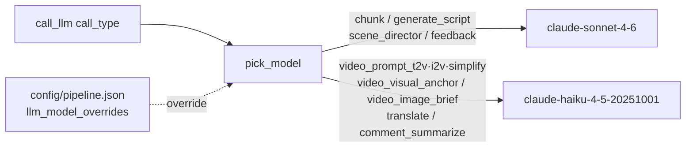
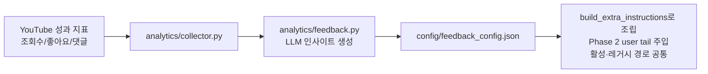

# WaggleBot — AI 파이프라인 (8-Phase)

> **last-verified:** 2026-06-13
> **scope:** 8-Phase AI 파이프라인 상세, LLM 라우팅, 4단계 폴백 — SSOT

## 개요

`ai_worker` 서비스가 실행하는 콘텐츠 처리 파이프라인. `APPROVED` 상태 Post를 받아 최종 영상까지 생성.

## 전체 파이프라인 흐름

## Phase별 상세

### Phase 1 — analyze_resources
- `Post.content`, `Post.images` 분석
- 이미지 수 / 텍스트 길이 비율 계산 → `ResourceProfile`
- 후속 씬 배분 전략 결정에 활용

### Phase 2 — chunk_with_llm
- **모델**: `sonnet` (call_type: `chunk`), **temperature 0.7** (창의적 구어체), max_tokens는 api 백엔드에서 8192 보정
- Post 원문을 의미 단위로 분할해 대본 초안 생성
- **입력 (user tail, 동적)**: 제목 + 본문(최대 4000자) + 베스트 댓글 5개("닉:내용") + 추가 지시(성과 피드백·A/B variant). 제목·댓글·피드백은 `processor.llm_tts_stage`(활성)와 `content_processor.process_content`에서 주입 — 댓글이 있어야 `type=comment` 인용 씬이 생성됨
  - 추가 지시는 `analytics.feedback.build_extra_instructions()`가 조립 (feedback_config.json의 extra_instructions + mood_weights>1.1 선호 힌트 + variant_config). chunk(활성)/generate_script(레거시) 양 경로 공통
- **system 프롬프트 (정적 캐시 prefix)**: 페르소나 + §0 자연스러움 + §1 자극 수위(순화) + **§2 리텐션 설계(2-1 Hook 강화 ~ 2-7 Closer)** + §3 자막 분할 + §4 블록·댓글·팩트 + 출력형식 + few-shot + 자가점검 + `get_llm_constraints_prompt()`. 동적 요소는 절대 system에 넣지 않음(캐시 무효화 방지)
- 출력: `raw script dict` (hook/body/closer/title_suggestion/tags/mood)

### Phase 3 — validate_and_fix
- `MAX_BODY_CHARS`, `MAX_HOOK_CHARS`, `MAX_CAPTION_CHARS` 검증
- **초과 시 로컬에서 `smart_split_korean()`으로 분할 보정** (LLM 재호출 없음). hook/closer는 초과 시 첫 청크만 남김
- 출력: `validated script dict`

### Phase 4 — SceneDirector
- **모델**: `sonnet` (call_type: `scene_director`)
- 씬별 `type` (intro / image_text / text_only / image_only / video_text / **comments**(신규) / outro) + `mood` 태그 할당
- `config/scene_policy.json`에서 씬 타입별 정책 로드
- 출력: `list[SceneDecision]`

**Mood 9종:**
| mood | 설명 |
|------|------|
| humor | 유머/웃음 |
| touching | 감동 |
| anger | 분노/공감 |
| sadness | 슬픔 |
| horror | 공포/소름 |
| info | 정보/지식 |
| controversy | 논란/논쟁 |
| daily | 일상/공감 |
| shock | 충격/반전 |

### Phase 4.5 — assign_video_modes
`VIDEO_GEN_ENABLED=true`일 때만 실행.
- 각 SceneDecision에 `video_mode` 설정
- `image_filter` 점수 ≥ `VIDEO_I2V_THRESHOLD(0.6)` → `i2v` (Image-to-Video)
- 미만 → `t2v` (Text-to-Video)
- i2v 선정 시 `scene.video_image_category`에 image_filter 분류
  (photo/meme/screenshot 등) 저장 — Phase 6 I2V 프롬프트의 vision 폴백 힌트로 사용

### Phase 5 & 6 — TTS 생성 ∥ video_prompt 생성 (병렬 실행)

`VIDEO_GEN_ENABLED=true`일 때 두 Phase가 `asyncio.gather`로 동시 실행된다.
Phase 5는 `scene.text_lines`, Phase 6은 `scene.video_prompt`만 변경하므로 안전하게 병렬화 가능.

**Phase 5 — TTS 생성** (OpenAudio S1-mini, ADR-0005)
- `worker/ai_worker/tts/fish_client.py`의 `synthesize(text, scene_type, voice_key, emotion)` 경유 (`http://fish-speech:8080`)
- **참조 음성:** `assets/voices/<key>/NN.wav+NN.lab` 존재 시 `reference_id` 클로닝(+memory cache), 없으면 base64 폴백, 그것도 없으면 기본 음색 + 경고
- **감정 마커:** `scene.tts_emotion`(scene_policy.json mood) → `TTS_EMOTION_MARKERS` → 정규화 텍스트 앞에 주입 (`(sad)` 등). content_processor·renderer 양 경로 모두 전달
- **정규화:** `normalize_for_tts()` — 슬랭/약어/숫자(소수·범위·전화·단위·유월/시월)·조사 교정(슬랭 경계 한정)
- **장문 분할:** 정규화 후 >150자면 문장 경계 분할 → 세그먼트별 합성 → concat → 후처리 1회
- **후처리:** 무음단축 → loudnorm → atempo(기본 1.2배) → **44100Hz mono 강제**(렌더러 concat 호환)
- **길이 검증:** WAV 헤더 파싱으로 초/자 계산, 0.05~0.35 범위 밖이면 재생성(비한국어/잘림 감지)
- 결과: `scene.text_lines = [{"text": "...", "audio": "/path/to/audio.wav"}]`
- 워밍업 센티널 (`MEDIA_DIR/tmp/fish_warmup_state.json`): 6시간 이내 재시작 시 풀 워밍업 스킵
- 음성 등록: `python -m tools.prepare_voice`(faster-whisper 자동 전사). 동일 key 재등록 시 fish-speech 재시작 필요(메모리 캐시 스테일)

**Phase 6 — video_prompt 생성 (prompt_engine V3)**
`VIDEO_GEN_ENABLED=true`일 때만 실행.
- **모델**: `haiku` (call_type: `video_prompt_t2v`/`video_prompt_i2v`/`video_prompt_simplify`/`video_visual_anchor`/`video_image_brief`) — 원격 LLM, GPU 미접촉 → 스레드 풀에서 실행
- 호출은 `call_llm(system=정적 템플릿, prompt=동적부, cache_prefix=True)` — api 백엔드에서 프롬프트 캐싱 적중
- **흐름 (전부 `generate_batch()` 내부 캡슐화 — 두 호출 경로 공용):**
  1. **비주얼 앵커** (post당 1회, T2V 씬 존재 시): 제목+대본 요약으로 주인공 외모/복장+장소+시간대 영어 2~3문장 생성 → 모든 T2V 씬에 주입 (클립 간 인물·배경 연속성). 실패 시 빈 앵커로 진행
  2. **I2V vision brief** (i2v 씬당 1회, `llm_backend=api` 전용): `video_init_image`를 haiku vision으로 분석해 이미지 내용 1~2문장 → 모션 프롬프트에 주입. 실패 시 post 내 vision 비활성 + `video_image_category` 힌트 폴백
  3. **씬별 프롬프트 생성**: 동적 길이(`estimated_tts_sec` 4~6초 클램프), 스토리 컨텍스트(제목+body_summary), 모션 아크(시작→전개→끝), 직전 씬 프레이밍 회피(샷 다양성), `config/video_styles.json` mood 스타일
  4. **출력 검증 + 재시도 + 폴백**: 한글/물음표/메타 마커("I'm an AI" 등)/길이 검증 → 실패 시 1회 재시도 → 재실패 시 mood별 결정적 폴백 프롬프트 (LLM 무관, 쓰레기 유입·파이프라인 중단 모두 차단)
- 결과: `scene.video_prompt` + `scene.video_prompt_simplified` (Phase 7 재시도용, 앵커 유지)

**하트비트 (`_touch_post`)**: 각 Phase 경계에서 `posts.updated_at` 갱신. 프론트엔드 progress 페이지에서 15분 이상 미갱신 시 "응답 없음" 배지 표시.

### Phase 7 — video_clip 생성
`VIDEO_GEN_ENABLED=true`일 때만 실행.
- ComfyUI API (`http://comfyui:8188`) 통해 LTX-2 19B 워크플로우 실행

**4단계 폴백:**

**LTX-2 프레임 규칙:** `1+8k` (9, 17, ..., 145) — `video_utils.validate_frame_count()` 필수.
프레임 수는 `scene.estimated_tts_sec` 기반 동적 계산(`calc_frames_from_duration`),
상한 `VIDEO_NUM_FRAMES_MAX=145`(6.04초 @24fps) — 씬 병합 4.0~6.0초 정책과 동기
→ [ADR-0004](adr/0004-clip-4-6s-frames-145.md)

### Phase 8 — FFmpeg 렌더링
- `h264_nvenc` (NVENC 필수, `libx264` 금지)
- 최종 해상도: 9:16 (`1080×1920` 기본)
- 프리뷰(480×854)는 CPU 인코딩 허용
- 자막: ASS 형식 (`subtitle_font`: NanumGothic)
- 썸네일 동시 생성
- BGM 볼륨: `bgm_volume=0.15`
- **아웃트로:** 구독유도 → 댓글 참여 유도 질문 + 마스코트 목업으로 교체 (layout.json `scenes.outro`)

## LLM 모델 라우팅

모든 LLM 호출은 `worker/ai_worker/llm/transport.py`의 `call_llm()` 경유 — 직접 HTTP 호출 금지.
`call_llm(images=[...])`은 vision 입력(api 백엔드 전용, base64 image block) — cli 백엔드는 무시+경고.
호출 전 `llm_backend_supports_vision()`으로 판단할 것.

## 처리 루프

`ai_worker` (processor.py):
1. `Post.status == APPROVED` 폴링 (`AI_POLL_INTERVAL=10초`)
2. 상태 → `PROCESSING` 전환
3. 8-Phase 실행
4. 성공 → `PREVIEW_RENDERED` / `RENDERED`
5. 실패 → `FAILED`, `retryCount++`, `MAX_RETRY_COUNT=3` 초과 시 영구 실패

## 피드백 루프

> 피드백 주입은 `analytics.feedback.build_extra_instructions()`를 경유한다. extra_instructions + mood_weights>1.1 선호 mood 힌트 + A/B variant_config를 합쳐 Phase 2(chunk)·레거시(generate_script) 양 경로의 user tail에 붙인다.
