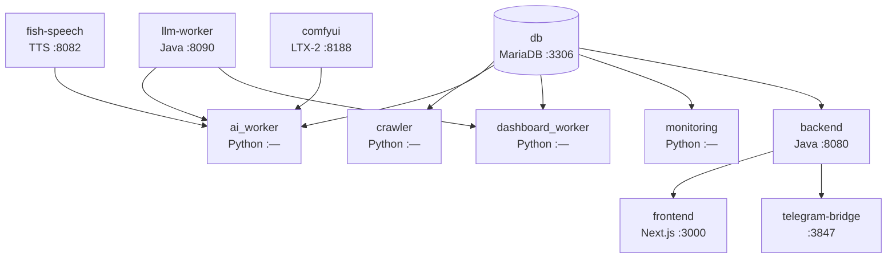
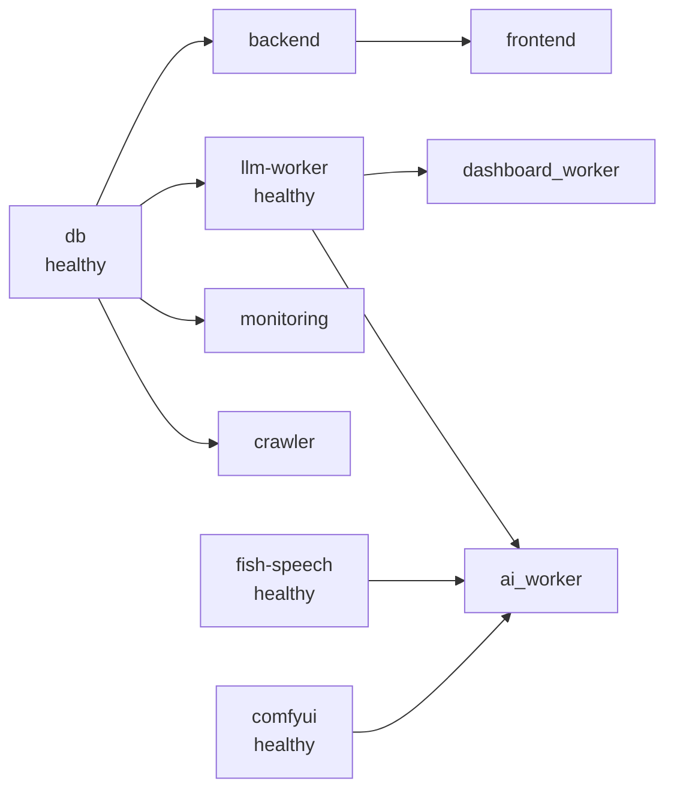

# WaggleBot — Docker 서비스 구성

> **last-verified:** 2026-06-12 (commit `656dffd`)
> **scope:** Docker 서비스 포트/볼륨/환경변수/의존성 — SSOT

## 서비스 의존성 그래프



---

## 서비스 상세

### db (MariaDB 11)
- **역할:** 중앙 영속성 저장소
- **포트:** `3306`
- **볼륨:** `mariadb_data:/var/lib/mysql` (named volume, 영구)
- **헬스체크:** `mariadb-admin ping` (10s interval, 5회 retry)
- **환경변수:** `MARIADB_DATABASE=wagglebot`, `MARIADB_USER=wagglebot`
- **모든 서비스의 시작 전제조건** (`service_healthy`)

---

### llm-worker (Java Spring Boot)
- **역할:** Claude CLI subprocess 게이트웨이. Python ai_worker의 모든 LLM 호출을 처리
- **소스:** `llm-worker/` (완전 구현)
- **포트:** `8090`
- **중요 볼륨:** `~/.claude:/root/.claude` — Claude CLI 구독 인증
- **헬스체크:** `wget -qO- http://localhost:8090/healthz` (30s, 5회)
- **주요 설정:**
  ```
  LLM_DEFAULT_MODEL=claude-haiku-4-5-20251001
  LLM_REPORT_MODEL=claude-sonnet-4-6
  LLM_POOL_SIZE=100
  LLM_QUEUE_CAPACITY=500
  ```
- **Dockerfile:** JDK21 빌드 → JRE21 + Node.js/npm + claude CLI 설치

---

### crawler (Python)
- **역할:** 커뮤니티 사이트 크롤링, Post/Comment DB 저장
- **소스:** `worker/` (Dockerfile), `python main.py` 실행
- **볼륨:** `../worker:/app`, `../config:/app/config`
- **환경변수:**
  ```
  DATABASE_URL=mysql+pymysql://wagglebot:...@db/wagglebot
  CRAWL_INTERVAL_HOURS=1
  ```
- **크롤러 플러그인:** `worker/crawlers/` — nate_pann, bobaedream, dcinside, fmkorea
- **동적 사이트 목록:** `CrawlerRegistry.list_crawlers()` (하드코딩 금지)

---

### ai_worker (Python)
- **역할:** 8-Phase AI 파이프라인 실행 루프 (`python -m ai_worker.core.main`)
- **소스:** `worker/` (Dockerfile)
- **볼륨:**
  - `../worker:/app`
  - `../assets/media:/app/media`
  - `/usr/lib/wsl/lib:/usr/lib/wsl/lib:ro` (WSL2 NVENC 라이브러리)
- **GPU:** NVIDIA 전체 장치 + `NVIDIA_DRIVER_CAPABILITIES=all`
- **환경변수:**
  ```
  LLM_WORKER_URL=http://llm-worker:8090
  FISH_SPEECH_URL=http://fish-speech:8080
  COMFYUI_URL=http://comfyui:8188
  VIDEO_GEN_ENABLED=false   (기본값, true로 변경 시 Phase 4.5~7 활성화)
  DATABASE_URL=...
  MEDIA_DIR=/app/media
  ```
- **종료 유예:** `stop_grace_period: 120s` (진행 중인 파이프라인 보호)
- **depends_on:** db, fish-speech, comfyui, llm-worker (모두 healthy 확인)

---

### fish-speech
- **역할:** Zero-shot 음성 클로닝 TTS (**OpenAudio S1-mini**, ADR-0005)
- **이미지:** `wagglebot/fish-speech-s1:cuda` (S1 커밋 d3df50에서 로컬 빌드 — 사전빌드 태그는 s1-mini 비호환)
  - 재빌드: `scripts/build_fish_speech_s1.sh`
- **포트:** `8082→8080`
- **GPU:** RTX 3090, VRAM ~4GB
- **볼륨:**
  - `../checkpoints/openaudio-s1-mini:/app/checkpoints/openaudio-s1-mini` — 모델 가중치 (서브디렉토리만)
  - `../assets/voices:/app/references` — 참조 음성 (**UID 1000 소유 필수** — validate_env 쓰기 권한 검사)
- **모델:** `checkpoints/openaudio-s1-mini/` (`download_openaudio_s1.sh`, gated HF — 로그인 필요)
- **참조 구조:** `assets/voices/<key>/NN.wav + NN.lab` → `reference_id` 클로닝 (`prepare_voice.py`로 등록)
- **env 오버라이드(필수):** `LLAMA_CHECKPOINT_PATH`/`DECODER_CHECKPOINT_PATH` — 이미지 기본값 s2-pro(VRAM 초과) 차단
- **시작 시간:** `start_period: 180s` (모델 로딩 대기)
- **healthcheck:** `curl`로 포트 리스닝 검사 (라우트 독립)
- **롤백:** ADR-0005 참조 (구 v1.5.1 블록 복원, `checkpoints/fish-speech-1.5/` 보존)

---

### comfyui
- **역할:** LTX-2 19B distilled 비디오 생성 (GGUF Q4, 8-step)
- **소스:** `env/Dockerfile.comfyui` (커스텀 빌드) + `env/ltxvideo_patches.py` (자동 패치)
- **포트:** `8188`
- **GPU:** RTX 3090, VRAM ~12.7GB (GGUF Q4 UNet) — Gemma 텍스트 인코더는 CPU
- **볼륨:**
  - `../checkpoints/ltx-2:/comfyui/models/checkpoints` — connector 파일
  - `../checkpoints/diffusion_models:/comfyui/models/diffusion_models` — GGUF UNet
  - `../checkpoints/vae:/comfyui/models/vae` — VAE
  - `../checkpoints/text_encoders:/comfyui/models/text_encoders` — Gemma-3-12B
  - `../worker/ai_worker/video/workflows:/comfyui/custom_workflows`
  - `../assets/media/tmp/videos:/comfyui/output` ← ai_worker와 공유
- **필요 모델 파일:**

  | 파일 | 크기 | 경로 (host) | HF 소스 |
  |------|------|-------------|---------|
  | `ltx-2-19b-distilled_Q4_K_M.gguf` | 12.7GB | `checkpoints/diffusion_models/` | `Kijai/LTXV2_comfy` |
  | `ltx-2-19b-embeddings_connector_distill_bf16.safetensors` | 2.9GB | `checkpoints/ltx-2/` | `Kijai/LTXV2_comfy` |
  | `LTX2_video_vae_bf16.safetensors` | 2.4GB | `checkpoints/vae/` | `Kijai/LTXV2_comfy` |
  | `gemma-3-12b-it-qat-q4_0-unquantized/` | ~15GB | `checkpoints/text_encoders/` | `google/gemma-3-12b-it-qat-q4_0-unquantized` |

  > 27GB FP8 full checkpoint는 시스템 RAM(17GB) 부족으로 사용 불가.
  > Kijai의 pre-extracted connector 파일(2.9GB)로 대체.

- **실행 플래그:** `--lowvram --reserve-vram 2 --fp8_e4m3fn-text-enc`
  - `--lowvram`: Gemma 텍스트 인코더 CPU 오프로드 필수 (BF16 24GB → VRAM 초과)
  - `--reserve-vram 2`: 2GB 예약 (Fish Speech 동시 실행 안전 마진)
- **주의:** `--normalvram` 절대 금지 (텍스트 인코딩 OOM 발생)
- **시작 시간:** `start_period: 300s` (Gemma 모델 로딩 5분)
- **빌드 시 자동 패치** (`env/ltxvideo_patches.py`):
  - kornia 0.8.3 호환: `pyramid_blending.py` — `pad` 제거 → `F.pad()` 대체
  - standalone connector AV prefix 감지: `embeddings_connector.py`
  - `is_av` 판별 수정: `text_embeddings_connectors.py`

---

### backend (Spring Boot)
- **역할:** REST API 서버, Job 큐 관리, 대시보드 백엔드
- **소스:** `backend/` (완전 구현)
- **포트:** `8080`
- **볼륨:** `../config:/app/config`, `../assets/media:/app/media`
- **환경변수:**
  ```
  SPRING_DATASOURCE_URL=jdbc:mariadb://db:3306/wagglebot
  MEDIA_DIR=/app/media
  FRONTEND_URL=http://frontend:3000
  ```

---

### frontend (Next.js 14)
- **역할:** 관리자 대시보드 UI
- **소스:** `frontend/` (완전 구현, 7개 어드민 페이지 운영 중)
- **포트:** `3000`
- **라우트 구조:**
  ```
  /admin/inbox        수신함 (COLLECTED 게시글)
  /admin/editor/[id]  편집실 (대본 수정/승인)
  /admin/gallery      갤러리 (완성 콘텐츠)
  /admin/progress     처리 진행 현황
  /admin/analytics    성과 분석
  /admin/llm-logs     LLM 호출 이력
  /admin/settings     파이프라인/업로더 설정
  ```
- **환경변수:** `BACKEND_URL=http://backend:8080`

---

### dashboard_worker (Python)
- **역할:** `jobs` 테이블 폴링, Java backend에서 enqueue한 작업 Python에서 실행
- **소스:** `worker/` Dockerfile, `python -m dashboard_worker.main`
- **볼륨:** `../worker:/app`, `../config:/app/config`, `../assets/media:/app/media`
- **환경변수:**
  ```
  DATABASE_URL=...
  LLM_WORKER_URL=http://llm-worker:8090
  FISH_SPEECH_URL=http://fish-speech:8080
  MEDIA_DIR=/app/media
  ```

---

### monitoring (Python)
- **역할:** 시스템 헬스체크, 알림 발송
- **소스:** `worker/` Dockerfile, `python -m monitoring.daemon`
- **환경변수 (주요):**
  ```
  GPU_TEMP_WARNING=75    GPU_TEMP_CRITICAL=80
  GPU_VRAM_WARNING=85    GPU_VRAM_CRITICAL=95
  DISK_USAGE_WARNING=80  DISK_USAGE_CRITICAL=90
  SLACK_ALERTS_ENABLED=false
  EMAIL_ALERTS_ENABLED=false
  HEALTH_CHECK_INTERVAL=300  (5분)
  ```

---

### telegram-bridge
- **역할:** Telegram 봇 통한 원격 제어 인터페이스
- **소스:** `telegram/` 디렉토리
- **포트:** `3847` (HOOKS_PORT)
- **볼륨:** 프로젝트 루트 read-only + `_request`, `_result` 디렉토리 쓰기
- **환경변수:**
  ```
  TELEGRAM_BOT_TOKEN=...
  ALLOWED_USER_IDS=...
  ANTHROPIC_API_KEY=...
  DAILY_BRIEF_ENABLED=false
  ```

---

## 볼륨 / 네트워크

```
볼륨:
  mariadb_data          - MariaDB 데이터 (named, Docker 관리)

공유 마운트 경로:
  ../assets/media/tmp/videos  ← comfyui output ↔ ai_worker 공유 (핵심)
  ../assets/voices            ← Fish Speech 참조 오디오
  ../checkpoints/             ← 모델 가중치 (fish-speech, ltx-2 등)
  ../config/                  ← Python 설정 (crawler, ai_worker, dashboard_worker)
  ~/.claude                   ← Claude CLI 인증 (llm-worker 전용)

네트워크:
  기본 bridge 네트워크 (서비스명으로 DNS 해석)
  ai_worker: extra_hosts - host.docker.internal:host-gateway (WSL2 호스트 접근)
```

## 시작 순서


