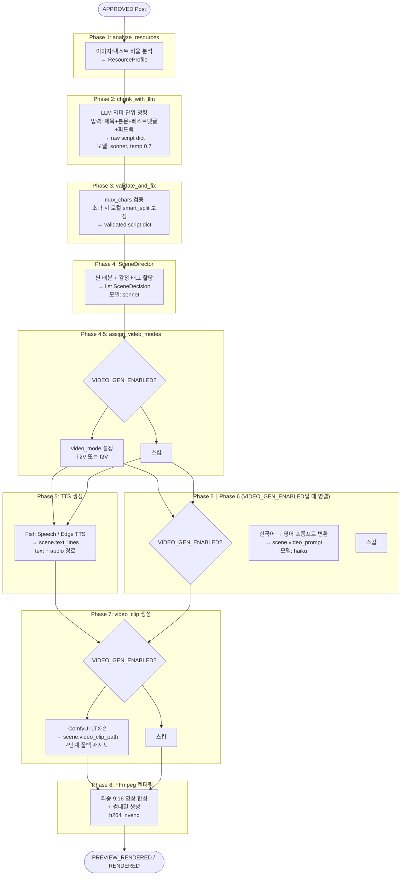
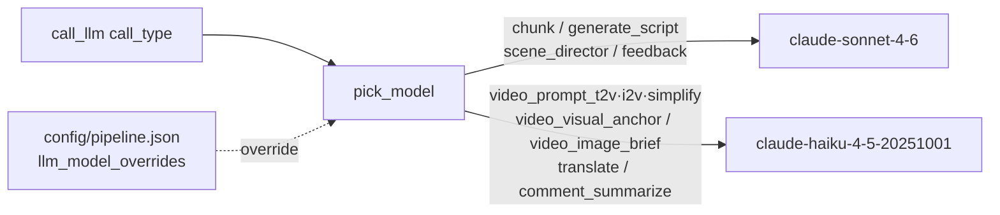

# WaggleBot — AI 파이프라인 (8-Phase) 컴포넌트

> last-verified: 2026-08-31 · code-ref: `worker/ai_worker/pipeline/content_processor.py`, `worker/ai_worker/core/processor.py`, `worker/ai_worker/scene/director.py`, `worker/ai_worker/renderer/`
> scope: 8-Phase AI 파이프라인 Phase별 책임, LLM 라우팅 — SSOT

## 개요

`ai_worker` 서비스가 실행하는 콘텐츠 처리 파이프라인. `APPROVED` 상태 Post를 받아 최종 영상까지 생성.

## 전체 파이프라인 흐름

<!-- last-verified: 2026-08-31 -->
<!-- code-ref: worker/ai_worker/pipeline/content_processor.py, worker/ai_worker/core/processor.py, worker/ai_worker/scene/director.py, worker/ai_worker/renderer/ -->

## Phase별 상세

### Phase 1 — analyze_resources
- `Post.content`, `Post.images` 분석
- 이미지 수 / 텍스트 길이 비율 계산 → `ResourceProfile`
- 후속 씬 배분 전략 결정에 활용

### Phase 2 — chunk_with_llm
- **모델**: `sonnet` (call_type: `chunk`), **temperature 0.7** (창의적 구어체), max_tokens는 api 백엔드에서 8192 보정
- Post 원문을 의미 단위로 분할해 대본 초안 생성
- Again-Spring은 후속 SceneDirector에서 본문을 20자 이하의 독립 화면 블록으로 다시 정규화한다. 범용 청커의 문장 병합 결과가 Tone L 본문 슬롯을 합치지 못하게 한다.
- **입력 (user tail, 동적)**: 제목 + 본문(최대 4000자) + 베스트 댓글 5개("닉:내용") + 추가 지시(성과 피드백·A/B variant). 제목·댓글·피드백은 `processor.llm_tts_stage`(활성)와 `content_processor.process_content`에서 주입 — 댓글이 있어야 `type=comment` 인용 씬이 생성됨
  - 추가 지시는 `analytics.feedback.build_extra_instructions()`가 조립 (feedback_config.json의 extra_instructions + mood_weights>1.1 선호 힌트 + variant_config). chunk(활성)/generate_script(레거시) 양 경로 공통
- **system 프롬프트 (정적 캐시 prefix)**: 페르소나 + §0 자연스러움 + §1 자극 수위(순화) + **§2 리텐션 설계(2-1 Hook 강화 ~ 2-7 Closer)** + §3 자막 분할 + §4 블록·댓글·팩트 + 출력형식 + few-shot + 자가점검 + `get_llm_constraints_prompt()`. 동적 요소는 절대 system에 넣지 않음(캐시 무효화 방지)
- 출력: `raw script dict` (hook/body/closer/title_suggestion/tags/mood)
- Again Spring의 `variant_config.pre_scripted=true`는 이 원격 LLM 단계를 건너뛰고 제목/본문의 결정적 로컬 분할로 `ScriptData`를 만든다. 긴급 마케팅 경로의 대기열 지연을 줄이기 위한 선택이며, 일반 잡 동작은 변경하지 않는다.

### Phase 3 — validate_and_fix
- `MAX_BODY_CHARS`, `MAX_HOOK_CHARS`, `MAX_CAPTION_CHARS` 검증
- **초과 시 로컬에서 `smart_split_korean()`으로 분할 보정** (LLM 재호출 없음). hook/closer는 초과 시 첫 청크만 남김
- 출력: `validated script dict`

### Phase 4 — SceneDirector
- **모델**: `sonnet` (call_type: `scene_director`)
- 씬별 `type` (intro / image_text / text_only / image_only / video_text / **comments**(신규) / outro) + `mood` 태그 할당
- `config/scene_policy.json`에서 씬 타입별 정책 로드
- 출력: `list[SceneDecision]`
- **outro_text 오버라이드**: `SceneDirector(..., outro_text=...)`가 지정되면 mood `fixed_texts`의
  `random.choice()`를 건너뛰고 그 문구를 그대로 사용. 외부 ingest(`/api/external/jobs`)가
  `contents.variant_config.outro_text`에 심어둔 값을 `processor._resolve_post_outro_text(post_id)`가
  읽어 전달한다. 단, Again-Spring은 참여 유도 CTA를 붙이지 않으므로 outro 씬을 만들지 않는다.

**Mood 9종:**
| mood | 설명 |
|------|------|
| humor | 유머/웃음 |
| touching | 감동 |
| anger | 분노/공감 |
| sadness | 슬픔 |
| horror | 공포/소름 |
| info | 정보/지식 |
| controversy | 논란/논쟁 |
| daily | 일상/공감 |
| shock | 충격/반전 |

> **video_gen 활성화 판정**: Phase 4.5~7은 `VIDEO_GEN_ENABLED=true`일 때만 실행되지만,
> 게시글 단위 오버라이드가 이를 대체할 수 있다. `ai_worker.core.processor.video_gen_enabled_for_post(post_id)`가
> `contents.variant_config.video_gen`(bool)이 있으면 그 값을 우선 적용하고, 없으면 전역 `VIDEO_GEN_ENABLED`를 따른다.
> 외부 ingest(`/api/external/jobs`)의 `options.videoGen`이 이 값을 채운다. `render_stage()`/`process_with_retry()`
> 양쪽 경로 모두 이 함수로 게이팅한다.

### Phase 4.5 — assign_video_modes
`VIDEO_GEN_ENABLED=true`일 때만 실행.
- 각 SceneDecision에 `video_mode` 설정
- `image_filter` 점수 ≥ `VIDEO_I2V_THRESHOLD(0.6)` → `i2v` (Image-to-Video)
- 미만 → `t2v` (Text-to-Video)
- i2v 선정 시 `scene.video_image_category`에 image_filter 분류
  (photo/meme/screenshot 등) 저장 — Phase 6 I2V 프롬프트의 vision 폴백 힌트로 사용

### Phase 5 & 6 — TTS 생성 ∥ video_prompt 생성 (병렬 실행)

`VIDEO_GEN_ENABLED=true`일 때 두 Phase가 `asyncio.gather`로 동시 실행된다.
Phase 5는 `scene.text_lines`, Phase 6은 `scene.video_prompt`만 변경하므로 안전하게 병렬화 가능.

**Phase 5 — TTS 생성** (OpenAudio S1-mini, ADR-0005)
- `worker/ai_worker/tts/fish_client.py`의 `synthesize(text, scene_type, voice_key, emotion)` 경유 (`http://fish-speech:8080`)
- **참조 음성:** `assets/voices/<key>/NN.wav+NN.lab` 존재 시 `reference_id` 클로닝(+memory cache), 없으면 base64 폴백, 그것도 없으면 기본 음색 + 경고
- **감정 마커:** `scene.tts_emotion`(scene_policy.json mood) → `TTS_EMOTION_MARKERS` → 정규화 텍스트 앞에 주입 (`(sad)` 등). content_processor·renderer 양 경로 모두 전달
- **정규화:** `normalize_for_tts()` — 슬랭/약어/숫자(소수·범위·전화·단위·유월/시월)·조사 교정(슬랭 경계 한정)
- **장문 분할:** 정규화 후 >150자면 문장 경계 분할 → 세그먼트별 합성 → concat → 후처리 1회
- **후처리:** 무음단축 없이 loudnorm → atempo(기본 1.1배) → **44100Hz mono 강제**(렌더러 concat 호환). 호흡·짧은 휴지를 잘라내지 않아 TTS 아티팩트를 줄인다.
- **디스크 캐시:** `processor._safe_generate_tts()`의 키는 `voice:text:speed:pp_v4`. 1.2배 시절의 `pp_v3` 캐시는 절대 재사용하지 않으며, 이후 speed 변경도 독립 캐시가 된다.
- **정렬 모델 cache:** alignment가 faster-whisper를 import하기 전에 `HF_HOME`·Hub·Xet·XDG cache를 모두 `WHISPER_DOWNLOAD_ROOT` 하위 writable 경로로 고정하고 Xet을 비활성화한다. 컨테이너 uid 1000의 `/.cache` 권한 오류를 피한다.
- **길이 검증:** WAV 헤더 파싱으로 초/자 계산, 0.05~0.35 범위 밖이면 재생성(비한국어/잘림 감지)
- 결과: `scene.text_lines = [{"text": "...", "audio": "/path/to/audio.wav"}]`
- 댓글 보이스는 작성자 값의 SHA-256으로 풀에서 결정적으로 선택한다. 댓글 chunk WAV는 `voice:text:emotion` 전역 캐시를 사용하므로 같은 댓글을 Reels·Shorts에서 다시 합성하지 않는다.
- 워밍업 센티널 (`MEDIA_DIR/tmp/fish_warmup_state.json`): 6시간 이내 재시작 시 풀 워밍업 스킵
- 음성 등록: `python -m tools.prepare_voice`(faster-whisper 자동 전사). 동일 key 재등록 시 fish-speech 재시작 필요(메모리 캐시 스테일)

**Phase 6 — video_prompt 생성 (prompt_engine V3)**
`VIDEO_GEN_ENABLED=true`일 때만 실행.
- **모델**: `haiku` (call_type: `video_prompt_t2v`/`video_prompt_i2v`/`video_prompt_simplify`/`video_visual_anchor`/`video_image_brief`) — 원격 LLM, GPU 미접촉 → 스레드 풀에서 실행
- 호출은 `call_llm(system=정적 템플릿, prompt=동적부, cache_prefix=True)` — api 백엔드에서 프롬프트 캐싱 적중
- **흐름 (전부 `generate_batch()` 내부 캡슐화 — 두 호출 경로 공용):**
  1. **비주얼 앵커** (post당 1회, T2V 씬 존재 시): 제목+대본 요약으로 주인공 외모/복장+장소+시간대 영어 2~3문장 생성 → 모든 T2V 씬에 주입 (클립 간 인물·배경 연속성). 실패 시 빈 앵커로 진행
  2. **I2V vision brief** (i2v 씬당 1회, `llm_backend=api` 전용): `video_init_image`를 haiku vision으로 분석해 이미지 내용 1~2문장 → 모션 프롬프트에 주입. 실패 시 post 내 vision 비활성 + `video_image_category` 힌트 폴백
  3. **씬별 프롬프트 생성**: 동적 길이(`estimated_tts_sec` 4~6초 클램프), 스토리 컨텍스트(제목+body_summary), 모션 아크(시작→전개→끝), 직전 씬 프레이밍 회피(샷 다양성), `config/video_styles.json` mood 스타일
  4. **출력 검증 + 재시도 + 폴백**: 한글/물음표/메타 마커("I'm an AI" 등)/길이 검증 → 실패 시 1회 재시도 → 재실패 시 mood별 결정적 폴백 프롬프트 (LLM 무관, 쓰레기 유입·파이프라인 중단 모두 차단)
- 결과: `scene.video_prompt` + `scene.video_prompt_simplified` (Phase 7 재시도용, 앵커 유지)

**하트비트 (`_touch_post`)**: 각 Phase 경계에서 `posts.updated_at` 갱신. 프론트엔드 progress 페이지에서 15분 이상 미갱신 시 "응답 없음" 배지 표시.

### Phase 7 — video_clip 생성
`VIDEO_GEN_ENABLED=true`일 때만 실행.
- ComfyUI API (`http://comfyui:8188`) 통해 LTX-2 19B 워크플로우 실행
- **LTX-2 프레임 규칙:** `1+8k` (9, 17, ..., 145) — `video_utils.validate_frame_count()` 필수.
  프레임 수는 `scene.estimated_tts_sec` 기반 동적 계산(`calc_frames_from_duration`),
  상한 `VIDEO_NUM_FRAMES_MAX=145`(6.04초 @24fps) — 씬 병합 4.0~6.0초 정책과 동기
  → [ADR-0004](../../shared/90-adr/0004-clip-4-6s-frames-145.md)
- 4단계 폴백 상세 → [`docs/worker/60-runtime.md`](../60-runtime.md)

### Phase 8 — FFmpeg 렌더링
- `h264_nvenc` (NVENC 필수, `libx264` 금지)
- 최종 해상도: 9:16 (`1080×1920` 기본)
- 프리뷰(480×854)는 CPU 인코딩 허용
- 자막: ASS 형식 (`subtitle_font`: NanumGothic)
- 썸네일 동시 생성
- BGM 볼륨: `bgm_volume=0.15`
- **아웃트로:** 기본 Waggle 채널은 댓글 참여 유도 질문 + 마스코트 목업을 사용한다. Again-Spring은 사연/댓글 뒤에 CTA 아웃트로를 추가하지 않는다.
- **시봄이(Sibom) 모션**: `layout.py`에서 `_sibom_variant()` 및 `_wire_sibom_motion()`으로 캐릭터 등장 및 루프 모션 처리. 등장 punch(**24프레임**, ease-out scale 92→100 + 페이드, `_SIBOM_PUNCH_POP_FRAMES`) + dwell 루프(사인 기반 `sway`/`shake`/`sob`/`sink`/`pop`). 모션 종류는 `catalog.json` per-image `motion` 필드가 결정. `intro`/`image_text` 씬에서 호출되며 실패 시 정지 프레임으로 graceful degrade. 검증: `test_sibom_motion.py`(유닛 18개)·`smoke_sibom_motion.py`(픽셀 검증)
- **v2 인트로 첫 프레임 강화 (2026-08-29)**: 실측 — marketing_v2 발행 0일차 평균 조회 475(v1 동일 일령의 37%), ffmpeg scene-detect(`select=gt(scene,0.25)`) 기준 첫 6초 장면전환 0회(완전 정지 화면). 반면 유지율은 v2 53% > v1 36%(본문은 정상 작동, 병목은 첫 프레임/노출). `_render_intro_frame_v2()`(`_frames.py`) 수정:
  - 훅 폰트: 고정 56px → `settings.yaml`의 `tone_v2.typography.hook_min_font_size_px`(기본 80px)를 실제로 읽어 적용. 3줄 wrap 초과 시 64px까지만 안전하게 축소(`hook_floor_fs`).
  - 훅 색상: 팔레트에 `ink_strong`(`#3D2A1F`, `config/layout.json` tone_l.palette 추가 키) 신규 — 기존 `ink`(`#5C4030`)보다 진한 동일 브라운 계열. 검정 미사용(Tone L 브랜드 유지).
  - 스텝닷(●○○)은 인트로 프레임에서만 제거(`_draw_step_dots()` 호출 삭제). 본문 image_text 씬은 유지.
  - 첫 3초 모션: `sibom_role`이 없는 일반 표지 사진 인트로는 기존에 모션이 전혀 붙지 않았다(정지 원인). 신규 `_intro_entrance_sequences()`(`layout.py`)가 기존 punch 프리미티브(`_sibom_pop_progress`/`_sibom_variant`/`_SIBOM_BREATHE_*` 상수)를 그대로 재사용해 캐릭터 punch-in(scale 92→100%, alpha 60→100%)과 훅 텍스트 페이드인(`_render_intro_frame_v2`의 `hook_alpha` 파라미터)을 같은 진행도로 동시에 건다. `sibom_role`이 있는 인트로는 기존 `_wire_sibom_motion()` 경로 그대로 유지.
  - 검증: `smoke_intro_v2.py`(정지 프레임 색상/폰트/스텝닷 검사 + punch·loop 프레임 픽셀 diff + 6초 클립 scene-detect 비교). ffmpeg `scene` 지표는 프레임 전체 대비 카드 영역만 바뀌는 애니메이션이라 `gt(scene,0.25)`(전체화면 컷 기준)까지는 못 미치지만, `gt(scene,0.003)` 기준으로 첫 6초 전환 0회→32회로 실측 개선(scdet 최대 점수도 0.002→0.178).
- **발화 싱크:** hook/body 통합 narrator WAV는 faster-whisper 단어 타임스탬프와 원문 줄을 정렬한다. 문자 수 비율·fade 추정은 쓰지 않는다. 첫 WAV는 PCM `-45 dBFS`/3-frame 기준 native lead를 측정해 150ms에 부족한 시간만 prepend하고, 이후 새 줄은 실제 해당 발화보다 150ms 먼저 표시된다. Again-Spring은 20자 이하 독립 블록을 화면당 최대 3개 누적한 뒤 다음 묶음에서 초기화된다.
- **클로징 타임라인:** 마지막 댓글 발화 종료 후 기존 화면을 250ms 유지 → 클로징 텍스트 표시 → 실제 첫 음절까지 150ms. cached/generated outro WAV의 선행 무음을 PCM `-45 dBFS` threshold(3-frame debounce)로 측정해 부족한 시간만 prepend하며 음성은 trim하지 않는다. 발화 후 500ms 여백을 두고, 최종 mux는 오디오 총 길이로 cap해 concat의 마지막 정지 프레임이 늘어나지 않게 한다.
- **정적 frame 길이:** ffconcat의 마지막 duration은 신뢰하지 않는다. terminal PNG를 중복하지 않고 static filter의 `tpad=stop_mode=clone:stop=-1`로 마지막 프레임을 유지한 뒤 최종 `-t`/`-shortest`로 cap한다. static/hybrid segment 출력은 CFR 30fps로 인코딩해 오디오와의 stream duration 차이를 최대 1 frame으로 제한한다.

## LLM 모델 라우팅

<!-- last-verified: 2026-08-31 -->
<!-- code-ref: worker/ai_worker/pipeline/content_processor.py, worker/ai_worker/core/processor.py, worker/ai_worker/scene/director.py, worker/ai_worker/renderer/ -->

모든 LLM 호출은 `worker/ai_worker/llm/transport.py`의 `call_llm()` 경유 — 직접 HTTP 호출 금지.
`call_llm(images=[...])`은 vision 입력(api 백엔드 전용, base64 image block) — cli 백엔드는 무시+경고.
호출 전 `llm_backend_supports_vision()`으로 판단할 것.

> 처리 루프·4단계 폴백·피드백 루프 → [`docs/worker/60-runtime.md`](../60-runtime.md)

## 부재하는 것 (정상/리팩터)

아래 README는 리팩터 후 폐기됐다. 내용은 이 문서에 통합한다.

- `worker/ai_worker/core/README.md` — 폐기 (2026-06-13)
- `worker/ai_worker/pipeline/README.md` — 폐기
- `worker/ai_worker/renderer/README.md` — 폐기
- `worker/ai_worker/scene/README.md` — 폐기
- `worker/ai_worker/script/README.md` — 폐기
- `worker/ai_worker/tts/README.md` — 폐기
- `worker/ai_worker/video/README.md` — 폐기
- `worker/ai_worker/tts/README.md`가 가리키던 `assets/pronunciation_map.json`, `assets/slang_map.json` — 자산 없음. 발음/슬랭 매핑은 코드·설정을 따른다.
