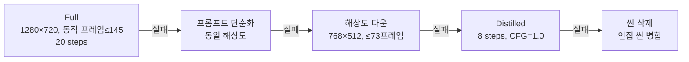
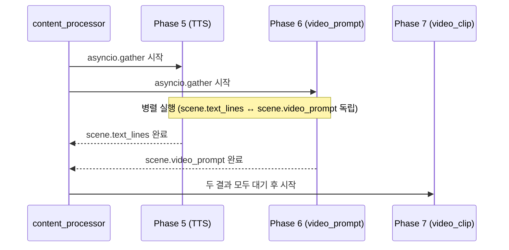
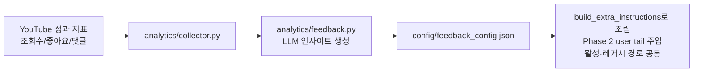

# WaggleBot — 파이프라인 런타임 동작

> last-verified: 2026-08-14 · code-ref: `worker/ai_worker/core/main.py`, `worker/ai_worker/core/processor.py`, `worker/ai_worker/renderer/`
> scope: ai_worker 처리 루프, 4단계 폴백, 피드백 루프, Phase5‖6 병렬 시퀀싱 — SSOT

## 처리 루프

`ai_worker/core/processor.py`:

1. `Post.status == APPROVED` 폴링 (`AI_POLL_INTERVAL=10초`). `again_spring`은 `MARKETING_CRITICAL`로 일반 잡보다 먼저 선택하며 렌더 대기열도 priority 순서다.
2. 상태 → `PROCESSING` 전환
3. 8-Phase 실행 (`content_processor.py`)
4. 성공 → `PREVIEW_RENDERED` / `RENDERED`
5. 실패 → `FAILED`, `retry_count++`, `MAX_RETRY_COUNT=3` 초과 시 영구 FAILED
6. **하트비트**: 각 Phase 경계에서 `posts.updated_at`와 `content_runtime_state(progress).last_heartbeat_at`을 갱신한다. 진행률·Phase 7 체크포인트·SLA·품질 진단은 서로 다른 state row를 원자적 upsert하므로 장시간 렌더 세션과 충돌하지 않는다.

렌더 단계는 진행률을 별도 세션으로 저장한 직후 기존 읽기 트랜잭션을 종료하고 최신 `contents` 행을 다시 읽는다. 마케팅 deadline 상태 저장이 같은 행의 오래된 스냅샷을 커밋해 MariaDB errno 1020으로 렌더를 실패시키는 것을 방지한다.

## Again Spring 마케팅 고속 경로

- 외부 요청이 `preScripted=true`이면 원격 Claude 청킹을 건너뛰고 제목/본문을 로컬 문장 분할해 TTS로 보낸다. Claude는 원격 호출이므로 GPU 락을 점유하지 않으며 Fish Speech와 비디오 구간만 같은 GPU 락을 사용한다.
- `deadlineAt`을 넘긴 critical 작업은 `FAILED`로 고정하지 않고 `content_runtime_state(sla)`에 degraded 사유를 남긴다. pre-scripted 마케팅 렌더의 댓글 정책은 SLA와 무관하게 좋아요 상위 2개(동률은 댓글 ID)다.
- 댓글 보이스는 작성자 해시로 결정적으로 선택하며 voice/text/emotion 키의 전역 WAV 캐시를 Reels·Shorts 재시도 간 공유한다.
- 본문 길이 품질 게이트는 hook·사연·CTA의 narrator WAV만 대상으로 한다. 댓글 2개와 아웃트로는 별도 tail이며 `generation_diagnostics`에 본문/댓글/아웃트로/최종 MP4 길이를 남긴다.

## 게시글별 video_gen 오버라이드

`processor.video_gen_enabled_for_post(post_id)`가 Phase 4.5~7 실행 여부를 결정한다:
`contents.variant_config.video_gen`(bool)이 존재하면 그 값을 우선 적용하고, 없으면 전역
`VIDEO_GEN_ENABLED`를 따른다. 외부 연동 ingest(`POST /api/external/jobs`)의 `options.videoGen`이
이 값을 채운다 — 예: Again Spring 사연은 기본 `video_gen=false`(정적 렌더링만).
동일하게 `processor._resolve_post_outro_text(post_id)`가 `variant_config.outro_text`를 읽어
`SceneDirector(..., outro_text=...)`로 전달하면 Phase 4의 아웃트로 문구 `random.choice()`를 건너뛴다.
Again Spring ingest의 고정 문구는 일반 사연 `여러분은 어떻게 생각하세요? 댓글로 알려주세요.`,
짝 사연 `상대방의 사연도 궁금하시죠? 댓글에서 확인해 보세요.`이다.

## 렌더 발화 싱크

Phase 8은 통합 narrator WAV를 글자 수로 나누지 않는다. `tts/alignment.py`가 faster-whisper의
단어 타임스탬프와 원문 줄을 대조해 실제 발화 시작을 구하고, 신뢰도 0.55 이상일 때만 그
경계를 사용한다. 정렬 실패는 안전하게 장면별 TTS로 폴백한다.

faster-whisper import 전 `config.settings.configure_huggingface_cache()`가 HF/Xet/XDG cache를
모두 `WHISPER_DOWNLOAD_ROOT` 하위로 설정하고 Xet을 비활성화한다. 이 설정은 uid 1000
ai_worker가 root의 `/.cache/huggingface/xet`에 쓰려다 실패하는 것을 막는다.

- 첫 줄은 영상 시작부터 표시한다. 첫 narrator PCM의 native lead를 `-45 dBFS`/3-frame 기준으로
  측정하고 150ms에 부족한 시간만 prepend한다. 원본 lead가 더 길면 trim하지 않는다.
- 이후 줄은 음성 타임라인을 바꾸지 않고 화면만 150ms 먼저 전환한다. text_only는 최대 3줄을
  순차 누적하고 다음 묶음에서 초기화한다.
- 마지막 댓글 발화 뒤 기존 화면을 250ms 유지한 뒤 클로징 텍스트를 표시한다. outro WAV의 선행
  silence는 PCM `-45 dBFS` threshold와 3-frame debounce로 측정하고 부족분만 prepend하여, 텍스트 뒤
  실제 첫 음절이 약 150ms에 오게 한다. WAV 음성/내부 휴지는 trim하지 않으며 발화 뒤 500ms 여백을 둔다.
- 최종 FFmpeg mux는 합성 오디오 총 길이로 `-t`/`-shortest`를 적용한다. 정적 PNG concat은 terminal
  PNG를 중복하지 않고 `tpad=stop_mode=clone:stop=-1`로 마지막 프레임을 유지하며 CFR 30fps로 출력한다.
- `processor._safe_generate_tts()` 디스크 캐시는 `voice:text:speed:pp_v4`를 사용한다. 따라서
  기본 속도 1.1배 전환 후 기존 `pp_v3`(1.2배) 결과를 재사용하지 않는다.

**#449 실측 검증 (2026-08-05):** 31.122336초 narrator WAV의 연속 26줄을
small/int8 CPU alignment으로 정렬했을 때 confidence `1.0`을 얻었다. 첫 150ms lead를 포함한
split+merge 결과는 31.272336초였고, lead를 제외한 소스 대비 peak/RMS 차이는 모두 `-inf dB`
(sample-identical)였다. 즉 정렬 분할·재결합은 음성 파형을 변형하지 않는다.

**정적 mux 실측 검증 (2026-08-05):** 원격 2-frame actual renderer smoke에서 video stream은
`4.666667s`/140 frames @30fps, audio stream은 `4.688844s`, container format duration은
`4.689s`였다. stream 차이는 `22.177ms`로 30fps 한 frame(`33.333ms`) 미만이며, extra tail이나
early video end가 없음을 확인했다.

**운영 #454 실측 검증 (2026-08-05):** native narrator lead `0.118s`에 부족한 `0.032s`만
prepend했다. 최종 MP4의 첫 text→speech silence는 `0.149592s`, outro text→speech는
`0.150159s`였다. video `55.766667s`/1673 frames @30fps, audio `55.770000s`, 차이
`3.333ms`이며 integrated loudness `-16.7 LUFS`, true peak `-1.5 dBFS`를 확인했다.

## Phase 7 — 4단계 폴백 (video_clip 생성)

`video_gen_enabled_for_post(post_id)`가 `true`일 때만 실행. ComfyUI LTX-2 실패 시 순차 폴백:

<!-- last-verified: 2026-08-14 -->
<!-- code-ref: worker/ai_worker/core/main.py, worker/ai_worker/core/processor.py, worker/ai_worker/renderer/ -->

- `video_prompt_simplified`(앵커 유지)를 F2에서 사용
- F4에서도 실패하면 해당 씬을 삭제하고 인접 씬을 병합하여 파이프라인 계속
- LTX-2 프레임 규칙: `1+8k` (9~145) — `video_utils.validate_frame_count()` 필수 → [ADR-0004](../shared/90-adr/0004-clip-4-6s-frames-145.md)

## Phase 5‖6 병렬 시퀀싱

`VIDEO_GEN_ENABLED=true`일 때 `asyncio.gather(tts_phase(), video_prompt_phase())`로 동시 실행.

<!-- last-verified: 2026-08-14 -->
<!-- code-ref: worker/ai_worker/core/main.py, worker/ai_worker/core/processor.py, worker/ai_worker/renderer/ -->

- Phase 5는 `scene.text_lines`, Phase 6은 `scene.video_prompt`만 변경 → 뮤텍스 불필요
- GPU Phase(TTS·ComfyUI)를 병렬에 포함 **금지** → [ADR-0003](../shared/90-adr/0003-phase56-parallel.md)

## 피드백 루프

<!-- last-verified: 2026-08-14 -->
<!-- code-ref: worker/ai_worker/core/main.py, worker/ai_worker/core/processor.py, worker/ai_worker/renderer/ -->

> 피드백 주입은 `analytics.feedback.build_extra_instructions()`를 경유한다. extra_instructions + mood_weights>1.1 선호 mood 힌트 + A/B variant_config를 합쳐 Phase 2(chunk)·레거시(generate_script) 양 경로의 user tail에 붙인다.

> Post 상태 전이 → [`docs/shared/60-runtime.md`](../shared/60-runtime.md)
> Phase별 책임 → [`docs/worker/30-components/pipeline.md`](30-components/pipeline.md)
